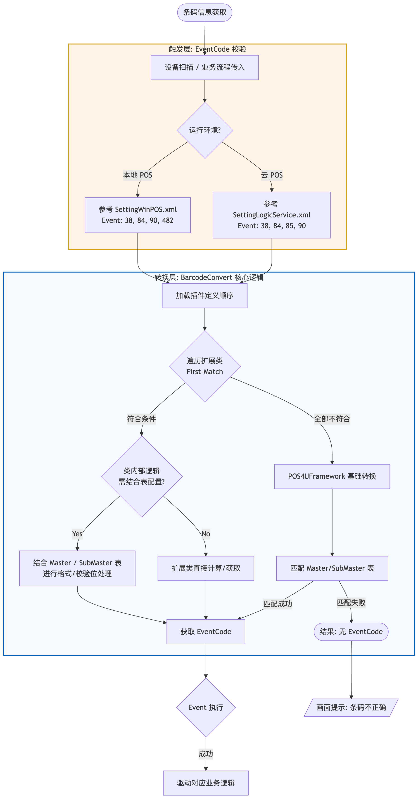

# 01. 処理概要

‌

本章节学习的前提：已经学习并且理解 [Event・Command 体系](https://retailai.atlassian.net/wiki/spaces/POSSYS/pages/3011936320)

## 背景说明：

作为POS系统重要的 外部信息输入 以及 事件触发 机制的重要部分，通过 扫码器，键盘，触摸屏幕等外接设备 或 其他处理 获得 输入用条码信息后，通过 BarcodeConvert 这个 核心业务处理机制，进行对应的Event事件的转换并触发Event的执行，实现业务驱动。

条码体系比较复杂（既有符合国际，行业标准的 条码，二维码，又有企业内部自定义的条码体系），本POS系统采用一套标准的处理流程应对。

同时，扫描条码后的识别响应速度直接影响使用体验，所以，这一套标准条码转换处理流程需要简洁高效。

## 概要说明：

本POS系统采用了基于POS4UFramework的条码处理体系，可以通过以下2种方式有效结合应对业务需求。

1. 通过POS4UFramework基础框架基础类库，通过在BarcodeConvertMaster表和BarcodeConvertSubMaster表内对条码的格式等进行定义，实现灵活的条码体系和事件转换的灵活控制。
2. 通过开发新的条码转换扩展类，自定义对于特定条码体系和事件转换的灵活控制。

## 处理流程概要：


＞详细处理步骤如下：

1. 条码信息获取

    1. 通过扫码器等设备从条码中获取
    2. 通过其他业务流程获取
    
2. 条码转换体系触发（通过预定义的Event触发）

    1. 本地POS应用：在 SettingWinPOS.xml中， BarcodeEventCodeCsv中配置EventCode
    
        1. 现时点(2024/11/2)的预定义事件有以下：
        
            1. EventCode=38 （Scanner1、Scanner2、Keyboard、TouchDisplay）
            2. EventCode=84（価格照会）
            3. EventCode=90（バーコードなし商品の商品売価一括取得）
            4. EventCode=482（キッチン商品の売価一括取得）
            
        
    2. 云POS应用：在 SettingLogicService.xml中， BarcodeEventCodeCsv中配置EventCode
    
        1. 现时点(2024/11/2)的预定义事件有以下：
        
            1. EventCode=38 （Scanner1、Scanner2、Keyboard、Touch）
            2. EventCode=84（価格照会）
            3. EventCode=85（指定商品訂正）
            4. EventCode=90（バーコードなし商品の商品売価一括取得）
            
        
    
3. 转换体系进行业务处理

    1. 首先 遍历 [条码转换扩展类](https://retailai.atlassian.net/wiki/spaces/POSSYS/pages/3011903651)，确定是否符合某个条码转换拓展类的处理对象
    
        1. 找到第一个符合条件的条码转换拓展类后，不再执行下一个条码转换类的符合判断。
        
            1. 确认条码转换类后，执行条码转换类内的处理逻辑，获取相应的EventCode。
            2. 在处理逻辑的执行过程中，可以通过BarcodeConvertMaster表和BarcodeConvertSubMaster表进行适当配置，灵活应对如条码格式变化，数字校检位等。
            
                1. BarcodeMemberScanConverter（会員バーコード）※无Mst/SubMst转换
                2. BarcodeCustomerModeConverter（セルフレジの各種バーコード）※有Mst/SubMst转换
                3. BarcodeBestBeforeConverter（26桁JAN）※有Mst/SubMst转换
                4. BarcodeDynamicPricingConverter（ダイナミックプライシング）※有Mst/SubMst转换
                5. BarcodeItemCodeConverter（商品コード）※无Mst/SubMst转换
                6. BarcodeMarkDownConverter（マークダウン）※有Mst/SubMst转换
                7. BarcodeNonBarcodeItemListConverter（バーコードなし商品）※无Mst/SubMst转换
                8. BarcodeOrderKitchenItemListConverter（キッチン商品）※无Mst/SubMst转换
                9. BarcodeCartTerminalNoScanConverter（ハイブリッドモードで登録機用）※无Mst/SubMst转换
                10. BarcodeQRConverter（QRコード支払）※无Mst/SubMst转换
                11. BarcodeNonPLUFoodConverter（フードパック会計用コード）※有Mst/SubMst转换
                12. BarcodeItemWithQuantityConverter（数量指定商品）※有Mst/SubMst转换
                13. BarcodeLogicServiceConverter（Azureのみ特別処理　※2026/04/14时点、根据代码分析结果，会员／员工／中间交易JAN均被作为PLU商品处理。  
                  从代码推测，云端Convert处理仅以商品code为对象，不包含其他类型code；但实际设计意图尚不明确，需进一步确认。）※无Mst/SubMst转换
                14. BarcodeItemListConverter（商品売価一括取得）※有Mst/SubMst转换
                
            
        2. 关于遍历执行的顺序
        
            1. 本地POS应用：由PluginWinPOS.xml配置文件的定义顺序决定。
            
                1. 现时点（2026/04/14）定义顺序如下：
                
                    1. BarcodeMemberScanConverter（会員バーコード）
                    2. BarcodeCustomerModeConverter（セルフレジの各種バーコード）
                    3. BarcodeBestBeforeConverter（26桁JAN）
                    4. BarcodeDynamicPricingConverter（ダイナミックプライシング）
                    5. BarcodeItemCodeConverter（商品コード）
                    6. BarcodeMarkDownConverter（マークダウン）
                    7. BarcodeNonBarcodeItemListConverter（バーコードなし商品）
                    8. BarcodeOrderKitchenItemListConverter（キッチン商品）
                    9. BarcodeCartTerminalNoScanConverter（ハイブリッドモードで登録機用）
                    10. BarcodeQRConverter（QRコード支払）
                    11. BarcodeNonPLUFoodConverter（フードパック会計用コード）
                    
                
            2. 云POS应用：由PluginLogicService.xml配置文件的定义顺序决定。
            
                1. 现时点（2026/04/14）定义顺序如下：
                
                    1. BarcodeItemWithQuantityConverter（数量指定商品）
                    2. BarcodeMarkDownConverter（マークダウン）
                    3. BarcodeItemListConverter（商品売価一括取得）
                    4. BarcodeLogicServiceConverter（Azureのみ特別処理　※2026/04/14时点、根据代码分析结果，会员／员工／中间交易JAN均被作为PLU商品处理。  
                      从代码推测，云端Convert处理仅以商品code为对象，不包含其他类型code；但实际设计意图尚不明确，需进一步确认。）
                    5. BarcodeBestBeforeConverter（26桁JAN）
                    6. BarcodeDynamicPricingConverter（ダイナミックプライシング）
                    7. BarcodeItemCodeConverter（商品コード）
                    
                
            
        
    2. 如全部遍历后 所有条码转换拓展类 都不符合。则会进入[POS4UFramework基础框架转换逻辑](https://retailai.atlassian.net/wiki/spaces/POSSYS/pages/3011936380)。通过BarcodeConvertMaster表和BarcodeConvertSubMaster表匹配，获取相应的EventCode。
    
4. 转换后的Event执行

    1. 根据获得的EventCode触发事件执行。
    2. 如没有获得EventCode，则在画面提示条码不正确的消息框。
    

‌

‌

参考：上記のmermaid図編集用

```
graph TD
    Start([条码信息获取]) --> Input[设备扫描 / 业务流程传入]
    
    subgraph Trigger [触发层: EventCode 校验]
        Input --> Env{运行环境?}
        Env -->|本地 POS| LocalXML[参考 SettingWinPOS.xml<br/>Event: 38, 84, 90, 482]
        Env -->|云 POS| CloudXML[参考 SettingLogicService.xml<br/>Event: 38, 84, 85, 90]
    end

    LocalXML --> Order[加载插件定义顺序]
    CloudXML --> Order

    subgraph Conversion [转换层: BarcodeConvert 核心逻辑]
        Order --> LoopStart{遍历扩展类<br/>First-Match}
        
        LoopStart -->|符合条件| IsSubMst{类内部逻辑<br/>需结合表配置?}
        
        IsSubMst -->|Yes| TableJoin[结合 Master / SubMaster 表<br/>进行格式/校验位处理]
        IsSubMst -->|No| DirectCode[扩展类直接计算/获取]
        
        TableJoin --> GetEvent[获取 EventCode]
        DirectCode --> GetEvent
        
        LoopStart -->|全部不符合| Framework[POS4UFramework 基础转换]
        Framework --> FinalTable[匹配 Master/SubMaster 表]
        FinalTable -->|匹配成功| GetEvent
        FinalTable -->|匹配失败| Fail([结果: 无 EventCode])
    end

    GetEvent --> Exec{Event 执行}
    Exec -->|成功| Business[驱动对应业务逻辑]
    Fail --> ErrorMsg[/画面提示: 条码不正确/]

    %% 样式美化
    style Conversion fill:#f5faff,stroke:#005fb8,stroke-width:2px
    style Trigger fill:#fff4e5,stroke:#d4a017,stroke-width:2px
```

‌
