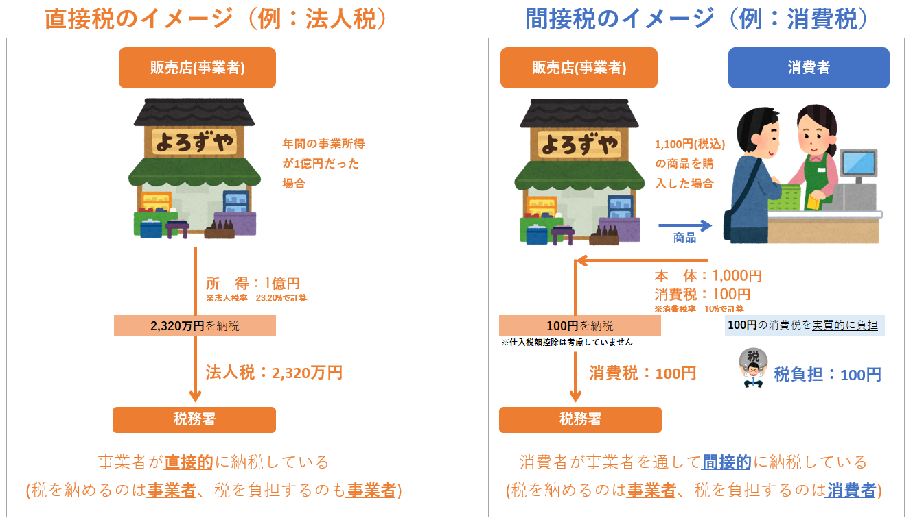

# 消費税の歴史と創設の背景

## １．日本における消費税の発祥

1989年（平成元年）4月1日、日本ではじめて消費税が導入されました。

導入されてから約30年、平成の歴史とともに歩み続けた消費税は、今の10代・20代の若い方々にとっては物心ついた頃から存在していた税金であり、無い時代が想像できないくらい身近なものとなっています。今やあたり前のように存在している消費税ですが、30年前の導入当時、世間は大変な騒ぎとなっていたことをご存知でしょうか。

消費税は、一般市民にとても身近な「消費」という行動に課せられる新たな税であり、毎日の暮らしを直撃するであろうその税金に対する拒否反応は凄まじく、各地で反対運動なども起こりました。テレビや新聞のニュースでも毎日のように消費税のことが取り上げられるなど、消費税に対する当時の国民の関心は相当なものでした。

その後、国民の反発を受けながらも、1997年に5％、2014年に8％と段階的に引き上げられ、2019年10月には10％(飲食料品や新聞は軽減税率適用で8％のまま)まで引き上げられました。

では、このような大反発を受けながらも国が消費税の導入を推進した背景にはどのような理由があるのでしょうか。

## ２．税制全体の公平性の確保

時代は戦後に遡ります。当時の日本の税制は、昭和25年のシャウプ勧告に基づいた**所得税中心の税体系**となっていました。しかし、戦後の復興期から高度成長期にかけて、日本の経済・社会は著しく変化し、税制についても様々なゆがみが目立ちはじめました。とりわけ給与所得に税負担が偏ってきたことにより、主な納税者である現役世代の重税感・不公平感が高まっていました。

また、わたしたちの国のように豊かで安全な暮らしを誰もが享受している社会においては、それを支えるための基本的な税負担は、**「国民ができる限り幅広く公平に分かち合うことが望ましい」**との考えも広まりはじめました。

## ３．個別間接税の問題点の解決

消費税は税を納める人と税を負担する人が異なる「間接税」と呼ばれる税です。

### 間接税とは

税を納める人と税を負担する人が同じである税金を「直接税」といいます。（法人税や所得税など）一方、税を納める人と税を負担する人が異なる税金を「間接税」といいます。（消費税や酒税など）

消費税導入前の間接税は、特定の物品やサービスに課税する個別間接税制度が中心で、物品税という贅沢品に対して税金をかける税制がありました。

### 物品税とは

物品ごとに必需品か贅沢品かを特定し、贅沢品にだけ課税する仕組みです。

### 物品税の一例

課税される物品

* 毛皮製品
* ゴルフ用具
* サーフボード、水上スキー
* 普通の家具（けやき製等）
* コーヒー、ウーロン茶

課税されない物品

* 高級織物（毛織物、絹織物）
* テニス用具
* スキー
* 桐製の家具、漆塗りの家具
* 紅茶、緑茶、玉露

しかし、所得水準の上昇や国民の価値観の多様化が進むにつれ、贅沢品として課税すべき物品やサービスを客観的基準で判断することが事実上困難となりました。また、お金を使う対象が物品（いわゆるモノ）からサービス（いわゆるコト）へと比重が変化する中で、物品とサービスとの間の負担の不均衡（物品ばかりが課税されている）という問題が生じていました。

## ４．高齢化社会への対応・消費税の導入

以上のようなことから、  
**① 税制全体としての負担の公平を高めるうえで間接税が果たすべき役割を十分に発揮させること**  
**② 個別間接税制度が直面している問題を根本的に解決すること**  
これらを主な目的として、「消費全体に広く薄く負担を求める消費税の創設が必要である」と考えられたのです。

### 間接税の代表格である消費税

先に述べたように消費税は、消費者が商品などを買う際に負担した税金を、消費税を受け取ったお店などの事業者が消費者の代わりに納める税金です。  
ではなぜ消費税は間接税の方式なのでしょうか。それは、もし直接税の方式にしてしまうと、消費者は購入したすべての商品やサービスなどを記録しておいて、それに消費税率を掛けた金額を毎年納めるようにしなければなりません。  
国民に課せられる事務負担や脱税行為抑止の観点などから考えても消費税が間接税であることは理にかなっていると言えます。

消費税の創設が叫ばれたもうひとつの大きな理由として、高齢化社会への対応という問題がありました。  
日本は、世界の主要国においても例をみない早さで人口の高齢化が進んでおり、年金、医療、福祉のための財源確保が喫緊の課題となっていました。従来のような現役世代（給与所得等）に頼った税制では、今後、働き手の税負担も限界に達するほか、納税者の重税感や不公平感が高まり、事業意欲や勤労意欲をも阻害することにもなりかねないことが懸念されました。

こうした社会問題に対する懸念も追い風となり、1988年（昭和63年）12月30日に消費税法が施行され、1989年（平成元年）4月1日から適用されることになったのです（消費税導入に伴い物品税は廃止）。

## ５．平成元年に導入され3度引上げ

消費税率は3％からスタートし、これまで3度引き上げられました。

| - | **税率** |
| --- | --- |
| 【創設時】1989年（平成元年）4月1日 | 3％ |
| 1997年（平成9年）4月1日 | 5％（国4％+地方1％） |
| 2014年（平成26年）4月1日 | 8％（国6.3％+地方1.7％） |
| 2019年（令和元年）10月1日 | 標準税率10%（国7.8％+地方2.2％）  
軽減税率8％（国6.24％+地方1.76％） |

‌

‌

‌

‌
