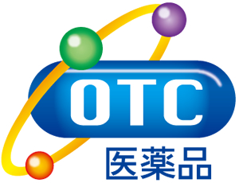
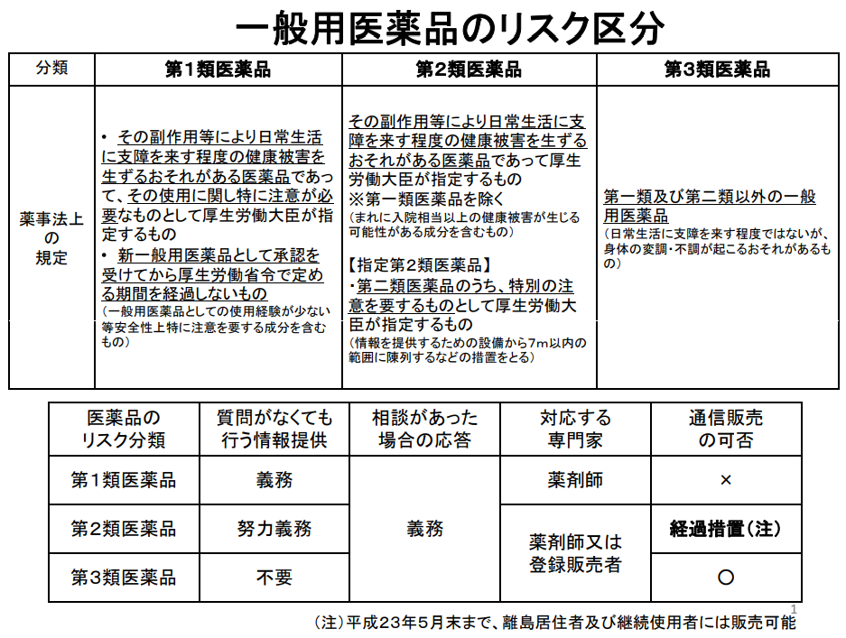
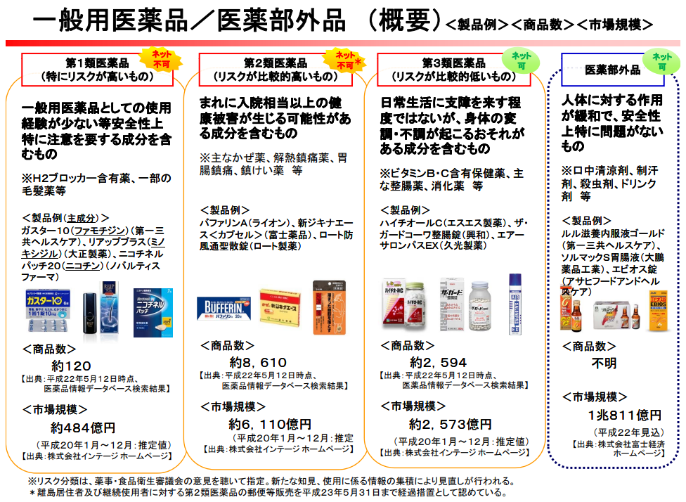

# 医薬品

## OTC医薬品とは

OTC医薬品とは医師に処方してもらう「医療用医薬品」ではなく、薬局やドラッグストアなどで自分で選んで買える「要指導医薬品」と「一般用医薬品」のことです。英語の「Over The Counter（オーバー・ザ・カウンター）」の略語で、対面販売でくすりを買うことを意味しています。これまで「大衆薬」や「市販薬」とも呼ばれてきましたが、最近、国際的表現の「OTC医薬品」という呼称が使われるようになりました。

‌

## OTC医薬品の分類

OTC医薬品は、医薬品の含有する成分を、使用方法の難しさ、相互作用（のみ合わせ）、副作用などの項目で評価し、分類されています。

### OTC医薬品の分類

| OTC医薬品分類 | 対応する専門家 | 販売者から  
お客様への説明 | お客様からの  
相談への対応 | インターネット、  
郵便等での販売 |
| --- | --- | --- | --- | --- |
| 要指導医薬品 | 薬剤師 | 対面で書面での情報提供  
（義務） | 義務 | 不可 |
| --- | --- | --- | --- | --- |
| 一  
般  
用  
医  
薬  
品 | 第1類医薬品 | 書面での情報提供（義務） | 可 |
| --- | --- | --- | --- |
| 第2類医薬品 | 薬剤師  
または登録販売者 | 努力義務 |
| 第3類医薬品 | 法律上の規定なし |

### 要指導医薬品

OTC医薬品として初めて市場に登場したもので慎重に販売する必要があることから、販売に際して、薬剤師が需要者の提供する情報を聞くとともに、対面で書面にて当該医薬品に関する説明を行うことが義務付けられています。  
そのため、インターネット等での販売はできません。店舗においても、生活者が薬剤師の説明を聞かずに購入することがないよう、すぐには手の届かない場所に陳列などすることとされています。

### 一般用医薬品

#### 第1類医薬品

副作用、相互作用などの項目で安全性上、特に注意を要するもの。店舗においても、生活者が薬剤師の説明を聞かずに購入することがないよう、すぐには手の届かない場所に陳列などすることとされています。販売は薬剤師に限られており、販売店では、書面による情報提供が義務付けられています。

#### 第2類医薬品

副作用、相互作用などの項目で安全性上、注意を要するもの。またこの中で、より注意を要するものは指定第2類医薬品となっています。第2類医薬品には、主なかぜ薬や解熱剤、鎮痛剤など日常生活で必要性の高い製品が多くあります。専門家からの情報提供は努力義務となっています。

#### 第3類医薬品

副作用、相互作用などの項目で、第1類医薬品や第2類医薬品に相当するもの以外の一般用医薬品。

* 「書面」については「所定の電磁的記録でも可」

なお、「要指導医薬品」以外のOTC医薬品（一般用医薬品）は、インターネットを含め、郵便等を通じ薬局・ドラッグストアから購入することが可能です。

## 薬の専門家

### 薬剤師

国家資格を持った薬の専門家です。医療用医薬品、要指導医薬品、第1類医薬品を含めた、すべての医薬品を取り扱うことができます。

### 登録販売者

都道府県知事が資格認定した、薬の専門家です。第1類医薬品を除く一般用医薬品を取り扱うことができます。

‌

‌

‌

‌
