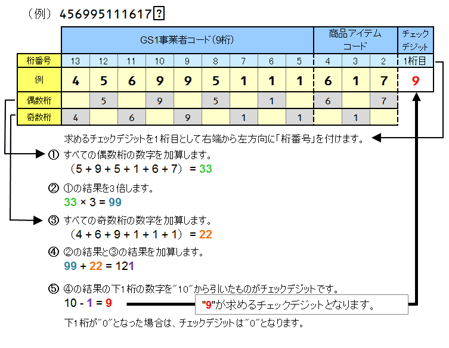
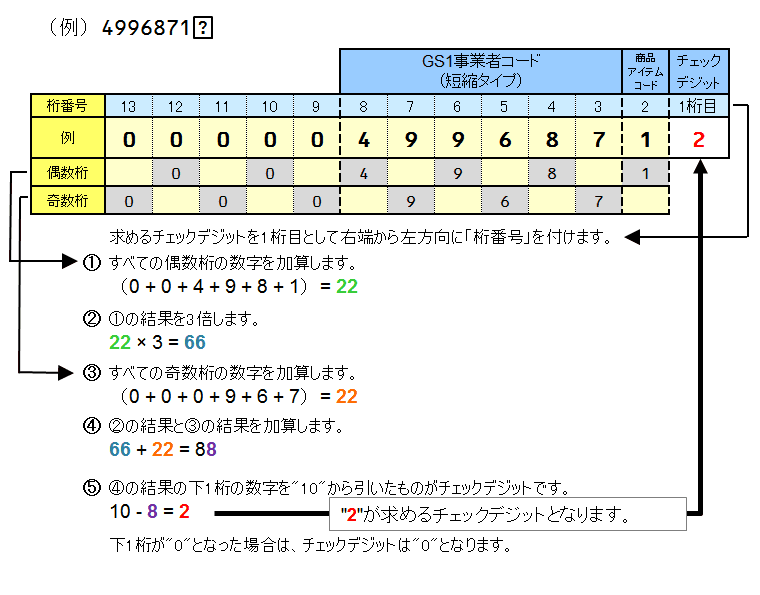
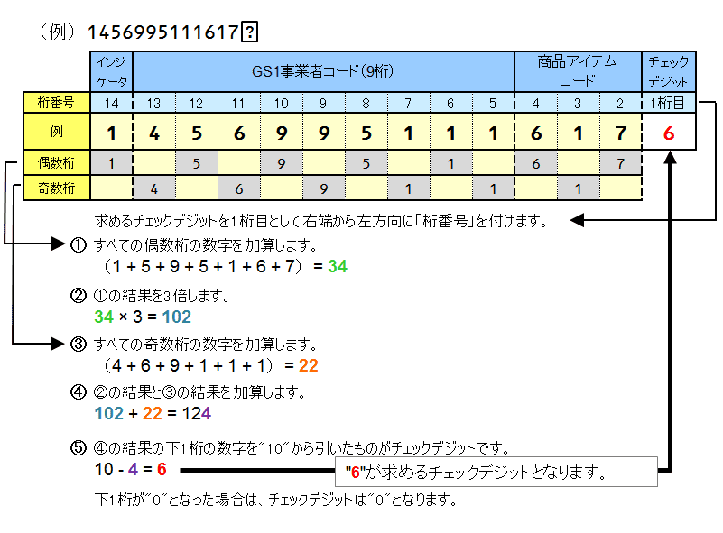
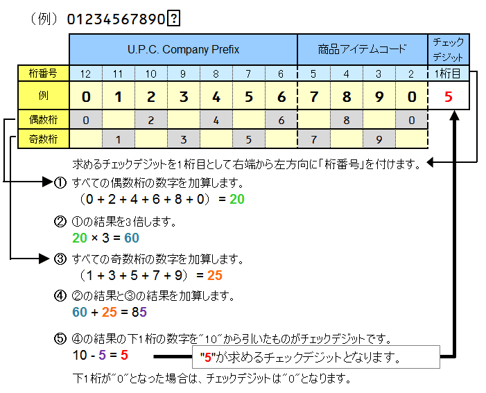
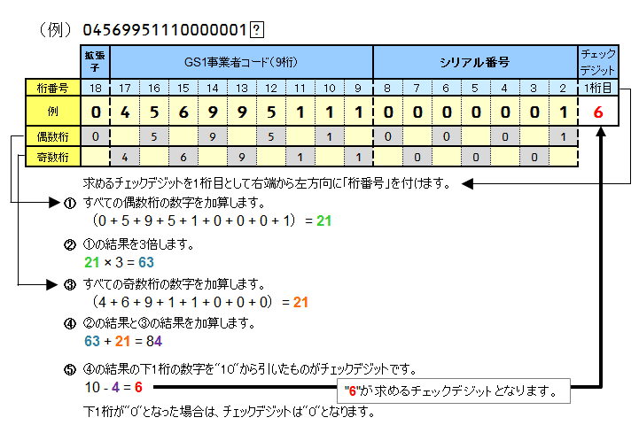

# GTINチェックデジットの計算方法

### GTIN（JANコード）標準タイプ（13桁）のチェックデジットの計算方法

例えば、GS1事業者コード“456995111”、商品アイテムコードを“617”と設定する場合、チェックデジットは次のように計算されます。

‌

### GTIN（JANコード）短縮タイプ（8桁）のチェックデジットの計算方法

例えば、GS1事業者コード“499687”、商品アイテムコードを“1”と設定する場合、チェックデジットは次のように計算されます。

‌

※GTIN-8ワンオフキーの場合、チェックデジットの計算は不要です。詳細は[こちら](https://www.gs1jp.org/code/jan/application_other/apply_for_gtin8_flow.html)を参照ください。

### GTIN（集合包装用商品コード）（14桁）のチェックデジットの計算方法

例えば、インジケータ“1”、GS1事業者コード“456995111”、商品アイテムコードを“617”と設定する場合、チェックデジットは次のように計算されます。GTIN（JANコード）のチェックデジット計算式と同じです。

‌

### U.P.C. (12桁）のチェックデジットの計算方法

例えば、U.P.C. Company Prefix“0123456”、商品アイテムコードを“7890”と設定する場合、チェックデジットは次のように計算されます。

‌

### SSCC（18桁）のチェックデジットの計算方法

例えば、拡張子“0”、GS1事業者コード“456995111”、シリアル番号を“0000001”と設定する場合、チェックデジットは次のように計算されます。

‌

‌
