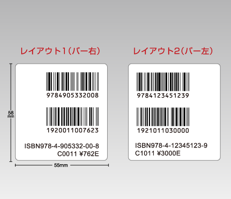
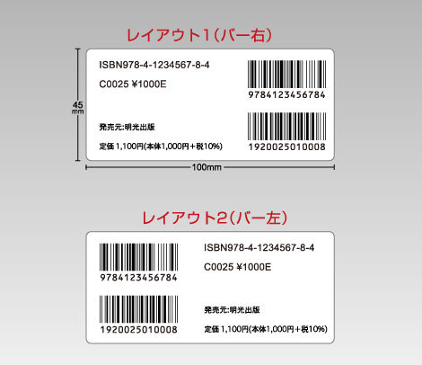

# 書籍JANコード

## 書籍JANコードとは

書籍JANコードとは、 出版物用のJANコードであり、通常のGTIN（JANコード）体系とは異なります。1990年3月に当財団と出版業界が合意して制定されました。

### 書籍JANコード体系

書籍JANコードは、2段のバーコードで構成されています。1段目は｢978｣から始まる国際標準コードのISBN（International Standard Book Numbering）用バーコードです。2段目は、日本独自の図書分類と税抜き本体価格です。  
1段目、2段目の情報は書籍の裏表紙及びスリップに表示されており、「日本図書コード」と呼ばれています。書籍JANコードは、日本図書コードの情報をバーコードで表示したもので、自動読み取り装置で情報を収集することができます。

現在、書籍へのバーコード表示率は、新刊ではほぼ100％に達しており、主に取次会社と書店で活用されています。 取次会社では、新刊の送品や注文品処理、返品処理の際に自動読み取りしており、物流のスピードアップとコスト削減に貢献しています。書店では、POSシステム、返品処理、棚卸し業務等に活用され、書店の単品在庫管理と売れ筋・死に筋管理に威力を発揮しています。

※日本図書コード、ISBNについてのお問い合わせは[日本図書コード管理センター](https://isbn.jpo.or.jp/)までお願いします。

### ・バーコードサンプル：

‌

‌

---

### 書籍JANコードの申請について

[書籍JANコード使用規約](https://www.gs1jp.org/assets/img/pdf/book_agreement.pdf)：書籍JANコードの申請にあたっては、こちらをご確認ください。

書籍JANコードの申請は下記窓口までお問い合わせください。

一般社団法人 日本出版インフラセンター  
日本図書コード管理センター

〒101-0051 東京都千代田区神田神保町1-32 出版クラブビル6F  
TEL：03-3518-9862 FAX：03-6273-7851  
電話受付時間 10：00～15：00  
URL： <custom data-type="smartlink" data-id="id-0">https://isbn.jpo.or.jp/</custom> 

### 書籍JANコード申請の流れ

### 書籍JANコードの登録・更新申請料

書籍JANコードの登録・更新申請料は、全書籍の売上高に応じて、下表の通りです。  
なお、書籍JANコードは3年毎に更新手続きが必要です。

（消費税10％込）

| ランク | 全書籍の年間売上高合計 | 申請料（3年間分） |
| --- | --- | --- |
| A | 500億円以上 | 110,000円 |
| B | 50億円以上～500億円未満 | 55,000円 |
| C | 10億円以上～50億円未満 | 33,000円 |
| D | 1億円以上～10億円未満 | 22,000円 |
| E | 1億円未満 | 11,000円 |

※消費税10%を含んだ金額となっております。  
※書籍JANコードの申請にあたっては、ISBN出版者記号を取得していることが必要です。また「書籍JANコード使用規約」への同意が必要です。
