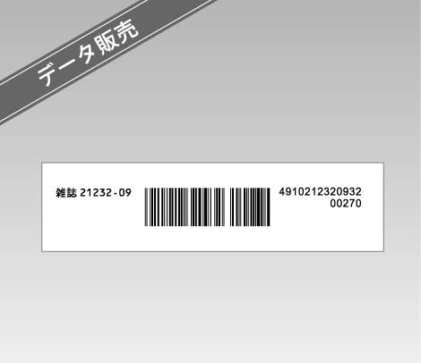
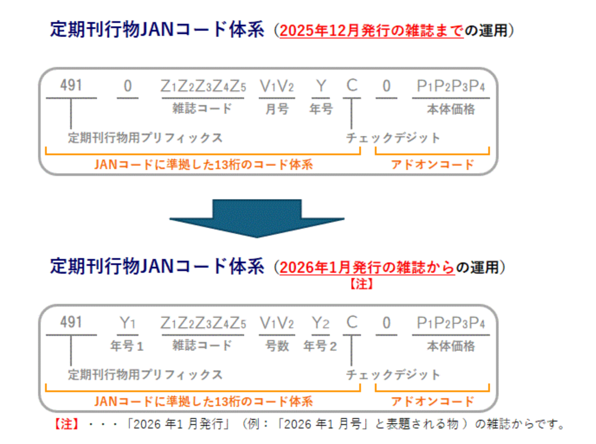

# 定期刊行物コード（雑誌）

## 定期刊行物コード（雑誌）とは

定期刊行物コード（雑誌）とは、販売（POS）や物流などにおいて、定期刊行物を識別するために最小限必要な情報をGTIN（JANコード）体系に準拠して表現したものです。雑誌を対象とするため、「定期刊行物コード（雑誌）」と呼ばれます。

現在のコード体系は2004年6月に実施され、GTIN（JANコード）に準拠した13桁のコード体系に、価格を表現するための5桁のアドオンコードを付加し、合計18桁で構成されています（下図参照）。

### 定期刊行物コード（雑誌）体系

※定期刊行物コード（雑誌）について詳しくお知りになりたい場合は、下記サイトに掲載の「定期刊行物コード（雑誌）登録とソースマーキングのガイド」をご参照ください。

日本出版インフラセンター（JPO）雑誌コード管理センター  
URL： [http://www.jpo.or.jp/magcode/](http://www.jpo.or.jp/magcode/) 

### ・サンプル

‌

‌

---

## 定期刊行物コード（雑誌）の申請について

[定期刊行物コード（雑誌）使用規約](https://www.gs1jp.org/assets/img/pdf/magazine_agreement.pdf)：定期刊行物コード（雑誌）の申請にあたっては、こちらをご確認ください。

定期刊行物コード（雑誌）の申請は、雑誌コード管理センターが窓口業務を委託している下記窓口までお問合わせください。

株式会社 トーハン 雑誌・仕入

〒162-8710 東京都新宿区東五軒町6-24  
TEL：03-3266-9530 FAX：03-3266-8937

※定期刊行物コード（雑誌）の申請にあたっては、雑誌コードの取得が別途必要です。(詳細は上記(株)トーハンへお問い合わせください）。また、「定期刊行物コード(雑誌)使用規約」への同意が必要です。

### 定期刊行物コード（雑誌）申請の流れ

### 定期刊行物コード（雑誌）の登録・更新申請料

定期刊行物コード（雑誌）の登録・更新申請料は、申請する出版者が発行する全雑誌の年間売上高に応じて、下表の通りです。  
なお、定期刊行物コード（雑誌）は3年毎に更新手続きが必要です。

（消費税10％込）

| ランク | 全雑誌の年間売上高合計 | 申請料（3年間） |
| --- | --- | --- |
| A | 500億円以上 | 110,000円 |
| B | 50億円以上～500億円未満 | 55,000円 |
| C | 10億円以上～50億円未満 | 33,000円 |
| D | 1億円以上～10億円未満 | 22,000円 |
| E | 1億円未満 | 11,000円 |

---

<コード名称変更に関する重要なお知らせ>

2025年8月1日から、定期刊行物コード（雑誌）のコード名称が定期刊行物JANコードへ変更されました。

<コード体系変更に関する重要なお知らせ>

2026年1月発行の雑誌から定期刊行物JANコードのコード体系が変更されます。  
従来の定期刊行物JANコードの頭から4桁目は、「0」の固定値でしたが、西暦年の下2桁目の数字に置き換えられます。（例：2026年の場合は「2」、2030年代の場合は「3」・・・）  
POSレジを含むシステムにおいて、定期刊行物JANコードを「4910」で始まるコードと設定している場合、バーコードの読み取りができない等の支障が生じる可能性があります。定期刊行物JANコードをご利用の関係各社のみなさまにおかれましては、お早めに準備や確認をお願いいたします。

詳しくは、日本出版インフラセンター（JPO）内、雑誌コード管理センターHPをご参照ください。  
URL： <custom data-type="smartlink" data-id="id-0">https://jpo.or.jp/magcode/</custom> 

参照：<custom data-type="smartlink" data-id="id-1">https://www.gs1jp.org/code/jan_periodical_publication/</custom>
