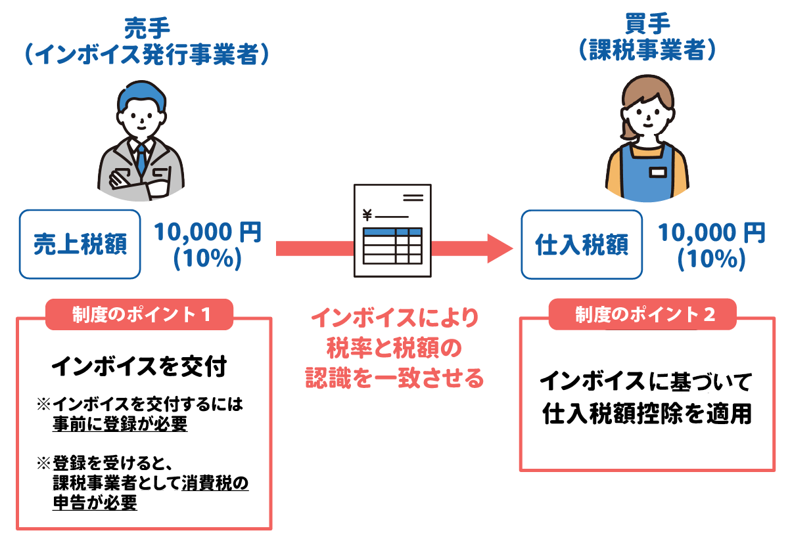
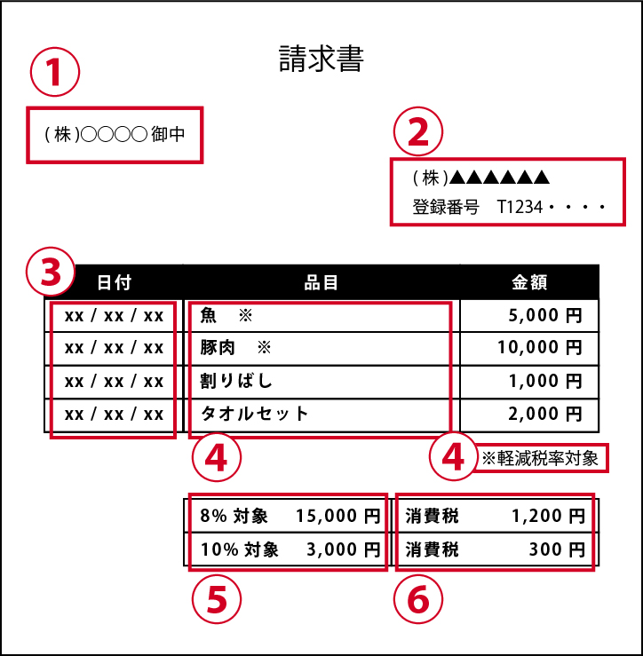
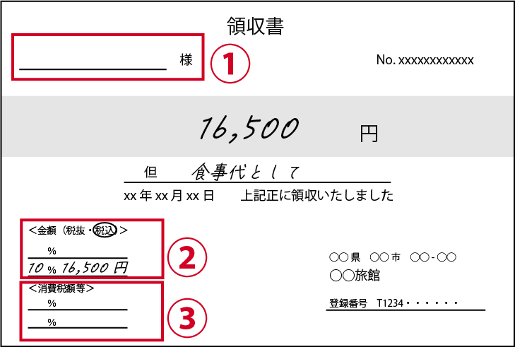

# インボイス制度

## インボイス制度って？

令和5年(2023年)10月1日からスタート。  
税率が複数あっても、事業者の方が消費税を正確に納めていただけるように、消費税の金額等を書いた請求書・領収書等（インボイス）を基に計算する仕組みです。

### 消費税の仕組み

消費税は、価格の一部として最終的に消費者の方が負担したものを、事業者の方に納付していただく仕組みです。事業者の方が納付する税額は、「売上げ時に受け取った消費税額」から「仕入れ等の際に支払った消費税額」を差し引いて計算します。

‌

**この差し引く計算を「仕入税額控除」**といい、  
仕入税額控除をするためには、その金額が正しいことを確認できるよう、インボイスの保存が必要です。

**インボイスがない仕入れや経費については、原則として、「仕入税額控除」ができません。**

※[簡易課税制度](https://www.nta.go.jp/taxes/shiraberu/taxanswer/shohi/6505.htm)や[２割特例](https://www.nta.go.jp/taxes/shiraberu/zeimokubetsu/shohi/keigenzeiritsu/invoice_2tokurei.htm)を使うことで、受け取ったインボイスを保存しなくても仕入税額控除を受けることができます。

※令和11年（2029年）9月末までは、インボイスの保存がなくても仕入税額相当額の一定割合を仕入税額とみなして控除できる経過措置が設けられています。詳しくは[こちら（PDF/810KB）](https://www.nta.go.jp/taxes/shiraberu/zeimokubetsu/shohi/keigenzeiritsu/pdf/qa/s03.pdf)をご覧ください。

‌

### 令和５年（2023年）10月１日からスタートしたインボイス制度って？

複数税率に対応し、**事業者の方が消費税を正確に納めていただくために必要な制度がインボイス制度**です。

‌

### インボイスの記載事項について

インボイスは、売手が買手に対して、正確な適用税率や消費税額等を伝えるものです。

具体的には、以下の事項が記載された書類やデータをいいます。なお、請求書に限らず、所定の事項が記載された書類であれば、領収書や納品書など書類の名称を問わず、インボイスとなります。

① インボイスの交付先である相手方の氏名または名称

② 売手(自社)の氏名又は名称及び**登録番号**

③ 取引年月日

④ 取引内容(軽減税率の対象品目である旨)

⑤ 10％・8％それぞれの対象となる対価の総額及び**適用税率**

⑥ 10％・8％それぞれの**消費税額等**

※ **下線部**は、特に注意する項目です。

※ 登録番号は、インボイス発行事業者の登録後に税務署から通知される番号です。

### 簡易インボイスについて

不特定多数の者に対して販売等を行う小売業、飲食店業、タクシー業では、次の図のように、インボイスの記載事項の一部を省略した簡易インボイスを交付することができます。交付できる業種については[こちら（PDF/305KB）](https://www.nta.go.jp/taxes/shiraberu/zeimokubetsu/shohi/keigenzeiritsu/pdf/qa/24.pdf)をご確認ください。

受け取ったインボイスに宛名等の記載がなくても、不備ではなく簡易インボイスである場合がありますのでご注意ください。

① 宛先は省略してOK

②・③ 税率又は税額のどちらか一方の記載でOK

※ 例の場合、適用税率のみの記載になっています。  
(消費税額等の記載は不要です。)

※法令上の記載事項ではありませんが、「記載不備のインボイスでは？」と取引先が誤解しないように「簡易インボイス対象である旨」を余白に記載することも一案です。

### 売手・買手の留意点

#### 売手側

* インボイスを交付するには**事前にインボイス発行事業者の登録を受ける必要**があります。
* ※登録を受けるかどうか悩んでいる方は[こちら](https://www.nta.go.jp/taxes/shiraberu/zeimokubetsu/shohi/keigenzeiritsu/invoice_kojin_01.htm#a-20)もご覧ください。
* インボイス発行事業者として登録を受けると、課税事業者として**消費税の申告が必要**になります。
* ※[簡易課税制度](https://www.nta.go.jp/taxes/shiraberu/taxanswer/shohi/6505.htm)や[２割特例](https://www.nta.go.jp/taxes/shiraberu/zeimokubetsu/shohi/keigenzeiritsu/invoice_2tokurei.htm)を使うことで、受け取ったインボイスを保存しなくても仕入税額控除を受けることができます。
* 売手側（インボイス発行事業者）は、買手側(取引相手である課税事業者)から求められたときは、インボイスを交付しなければなりません。
* 交付したインボイスの写しは、保存しておく必要があります。

#### 買手側

* 買手側が仕入税額控除の適用を受けるためには、原則として、売手（取引相手）であるインボイス発行事業者からインボイスを交付してもらい、**そのインボイスを保存しておく必要**があります。
* なお、[簡易課税制度](https://www.nta.go.jp/taxes/shiraberu/taxanswer/shohi/6505.htm)や[２割特例](https://www.nta.go.jp/taxes/shiraberu/zeimokubetsu/shohi/keigenzeiritsu/invoice_2tokurei.htm)を適用する場合、消費税の納付税額の計算に当たっては、インボイスの入手や保存は必要ありません。ただし、所得税等の観点からは、これまでどおり領収書や請求書などの書類の保存が必要です。
