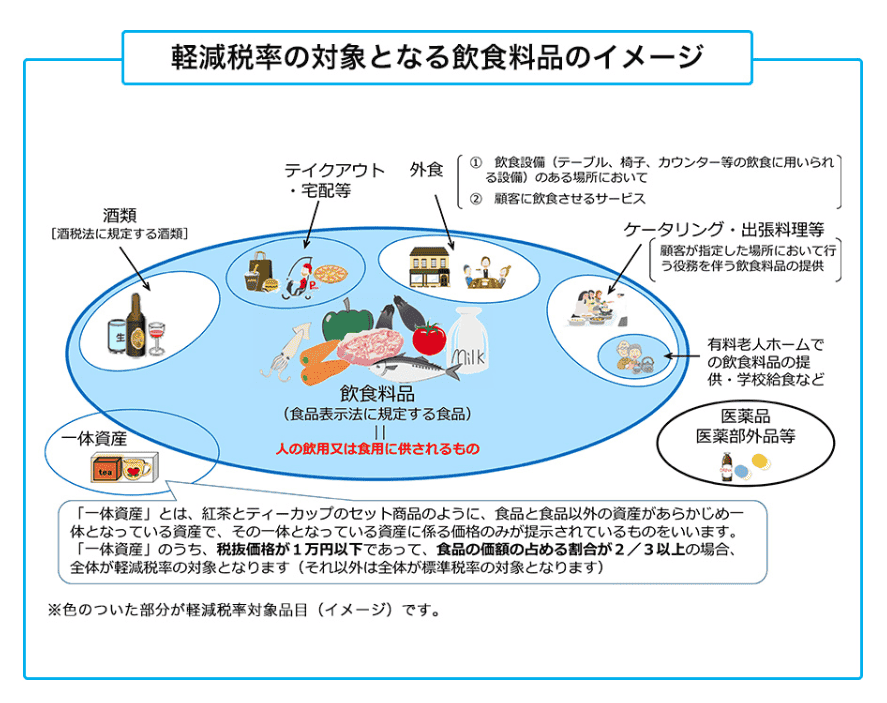

# 軽減税率制度

## 軽減税率とは

消費税は、令和元年10月に8％から10％に引き上げられました。しかし、一部の消費税の対象品目については、従来の8％が継続されることになりました。**令和6年度時点で、国内の消費税率は、8％と10％が混在する複数税率となっています。**

軽減税率とは、原則である10％となる標準税率とし、標準税率よりも低い税率、つまり、現行では消費税率8％のことをいいます。軽減税率8％の内訳は、消費税率6.24％、地方消費税率1.76％です。合計税率は軽減税率導入前後で8％と変更はないものの、消費税率と地方消費税率の割合は変更されています（軽減税率導入以前は消費税率6.3％、地方消費税率1.7％）。

## 軽減税率は「飲食料品」の判断が難解

**基本的には、アルコールを除く「飲食料品」と「新聞」の譲渡が軽減税率の対象とされています。**

**＜軽減税率の対象＞**  
・飲食料品（酒類、外食、ケータリング等を除く）  
・定期購読契約が締結された週2回以上発行される新聞  
参考｜[消費税の軽減税率制度（政府広報オンライン）](https://www.gov-online.go.jp/tokusyu/keigen_zeiritsu/taisyohinmoku/naniga.html)

しかし、この**飲食料品にはどんなケースが当てはまるのかを理解するのが非常に難しい**のです。外食は軽減税率の対象とならないので、自分の行為が飲食料品の購入なのか、外食なのかを正しく判断しないと、予期せぬ2％が発生するかもしれません。

‌

※消費税の軽減税率制度（政府広報オンライン）より引用
「いやいや、そんなの簡単だよ」

その気持ち、わかります。最初はみんなそう思っていました。しかし、いざ制度について考えてみると、曖昧で複雑な事例がたくさんあるのです。

## 軽減税率の対象品目

軽減税率はどのような品目に適用されるのでしょうか。軽減税率8％の対象品目と標準税率10％の対象品目それぞれについて、主なものを紹介します。

### 消費税8パーセントのもの

**軽減税率が適用されるのは、定期購読の新聞と酒類を除く飲食物です。**ただし、以下に取り上げる対象品目に該当しない飲食物は軽減税率の対象にはなりません。

| 軽減税率（消費税8％）に該当する代表的な対象品目 |
| --- |
| 定期購買契約により週2回以上発行される一般社会事実を掲載する「新聞」 スーパーなどで販売されている食品や飲料 テイクアウトの食品や飲料 栄養機能食品 健康食品 宅配の食品や飲料 有料老人ホームなどで提供される飲食物 食品とそのほかの資産が一体化したもので一定のもの  
（税抜1万円以下かつ食品の割合が3分の2以上のものに限る） ※軽減税率対象品目から酒類は除かれます。 |

スクロールできます

### 消費税10パーセントのもの

標準税率である消費税率10％が適用されるのは、軽減税率の適用外となる対象品目です。医薬品や書籍などの軽減税率には該当しない品目のほか、一部の飲食物は標準税率に区分されます。**飲食物については、軽減税率に該当するものと標準税率に該当するものが存在するため注意しましょう。**

| 標準税率（消費税10％）に該当する代表的な対象品目 |
| --- |
| 外食（飲食店で提供される飲食物） ケータリング（依頼人の指定する場所で調理などが行われる飲食物） 酒類 軽減税率に該当しない一体資産 医薬品（医薬品や医薬部外品の飲料含む） 化粧品 書籍 電気ガス代 携帯電話料金 ガソリン代 家具 家電 日用品（ティッシュなど） |

スクロールできます

## 消費税8％と10％を見極めるポイント

テレビ番組の軽減税率ネタが尽きないことからもわかるとおり、消費税8%と10％の見極めは難しいです。しかし、次の3つのポイントを押さえるだけで、各段に理解は深まり、悩む機会は減少するでしょう。

### (1)飲食料品の譲渡のポイントは「人の飲食用かどうか」

そもそも飲食料品の「譲渡」とは、いわゆる売買のことです。消費者の目線に立てば、食べ物や飲み物を買うこと。よって、**外食や出張調理などは「サービスの提供」であって、「譲渡」に含まれないため消費税8％**になりません。

そして重要なのが、**軽減税率制度における飲食料品とは、人の飲食用のもの**を指すことです。人が食べられるものであっても、動物が食べるためのものは軽減税率の対象となりません。例えば、とうもろこしを動物の餌として購入すると10%です。

ややこしい事例は多くあります。アルコールは10％ですが、アルコールを作るための原料となるお米の購入は軽減税率の対象です。水道水、生きた家畜、熱帯魚、観賞用植物は10％ですが、ミネラルウォーター、食用に加工した肉、活きあじ(魚の種類はあじに限らない)、食用アロエは8％です。

判断に迷ったら、食べられるかどうかではなく、人の飲食料品かどうかを検討してみてください。

### (2)外食のポイントは「飲食設備で食事したかどうか」

「外食」に該当すると、飲食料品の購入ではないので、消費税は10%となります。

**軽減税率制度における「外食」とは、「テーブルや椅子、カウンターなどのある場所で、食事をさせるサービスの提供」**をいいます（飲み物も含まれます）。

このテーブルや椅子、カウンターなどは、その規模や設置の目的を問わず、**飲食に用いられるのであれば「飲食設備」**とされ、飲食設備で食事するか否かで外食に当たるかどうか判断されます。

例を挙げると、

**・レストランやファーストフードの店内テーブルで食べる**  
**・屋台で買って備えつけのベンチで食べる**  
**・コンビニのイートインコーナーを利用する**  
**・公園内で営業するお店でそのお店で買った人しか使えないような椅子がある**

などの場合は、外食に含まれます。

なお、出前や宅配といった「飲食料品を届けるだけ」の行為は、食事をさせるサービスの提供には当たりません。

### (3)一体資産のポイントは「1万円以下」と「2/3以上」

一体資産とは、食品と食品以外のものがセットになって、それぞれの価格を分けることなく価格が提示されているものです。

この一体資産のうち、次の条件に当てはまるものは軽減税率の対象になります。

**＜軽減税率の対象になる一体資産＞**  
・一体資産の価格が税抜1万円以下  
・そのうち食品の価値が3分の2以上

例えば、価値の高い重箱がついてくる5万円のおせち料理の購入は10%になりますが、ビックリマンチョコはウエハースの価値が3分の2以上なので8%となります。

**一体資産と言っても、必ずしも軽減税率の対象とはならない**ので注意しましょう。

## 軽減税率の対応における注意点

軽減税率の対応にあたっての注意点を4つ取り上げます。

### 飲食料の売上がない会社も対応が必要

飲食物を販売するスーパーなど、飲食料の売上がある事業者は軽減税率の対応が必要だとイメージしやすいでしょう。**注意すべきなのは、飲食料の販売を事業としない会社でも対応しなければならないことです。**

一般の企業でも、会議のために飲み物やお菓子を購入したり、接待のために取引先の役員などと食事をしたりすることもあります。これらは飲食物の購入に該当するため、軽減税率と標準税率の区分が必要です。

ただし、[簡易課税](https://biz.moneyforward.com/accounting/basic/40960/)制度を適用している場合は、課税売上に対して一定のみなし仕入率を乗じて仕入[税額控除](https://biz.moneyforward.com/tax_return/basic/52228/)（仕入にかかる消費税額）を計算するため、標準税率と軽減税率を区分する必要はありません。

### 発行された請求書等の税率の確認が必要

簡易課税制度を適用しない消費税の課税事業者は、[請求書](https://biz.moneyforward.com/invoice/)や[領収書](https://biz.moneyforward.com/invoice/templates/receipts/)を受領した場合、記載されている税率が正しいか確認する必要があります。**標準税率と軽減税率を適切に区分して経理しなければならないためです。**受領した書類に記載された税率に、念のため誤りがないか確認してから記帳するようにしましょう。

### 必要に応じてシステムの導入が必要

**状況に応じて、標準税率と軽減税率のどちらにも対応したシステムの導入を検討する必要がります。**例えば、日常的に標準税率と軽減税率の品目を扱う小売業などでは複数税率レジの対応が求められます。飲食店でも、持ち帰りに対応している店舗の場合は、複数税率に対応できるレジがあった方がよいでしょう。

また、複数の品目を販売する業種でない場合も、標準税率と軽減税率に区分して記帳するときは、軽減税率に対応した[会計ソフト](https://biz.moneyforward.com/accounting)の導入を検討する必要があります。

### 必要に応じて適格請求書の対応が必要

令和5年10月より、原則として、仕入税額控除の要件を満たすには、適格請求書の保存が必要になりました。そのため、**消費税の課税事業者と取引を行っている場合は、標準税率と軽減税率を適切に区分して表示する一定の条件を満たした適格請求書の発行を求められることがあります。**

ただし、適格請求書を発行できるのは、消費税の課税事業者に限られます。免税事業者は、取引先の求めがある場合は、適格請求書に代わって、標準税率と軽減税率を区分して表示した区分記載請求書を交付します。
