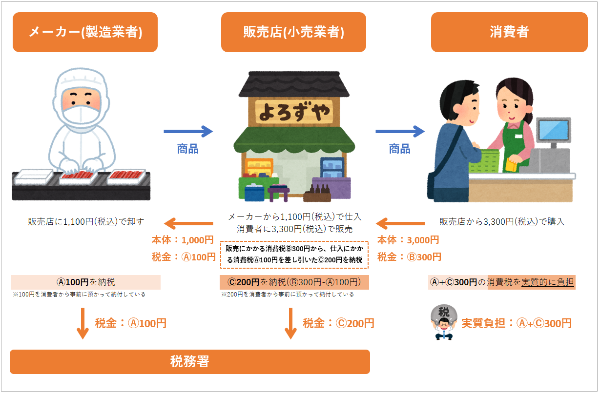

# 消費税とは

## １．消費税とは

消費税とは、物品やサービスの「消費」に着目し課税する間接税です。

医療や福祉、教育などの限定された一部のものを除き、国内で行われるほぼ全ての物品の販売やサービスの提供等を課税の対象にしています。取引の各段階でそれぞれの取引に対して10％又は8％の税率で課税されます。

＊標準税率10％（消費税率7.8％、地方消費税率2.2％）  
　軽減税率8％（消費税率6.24％、地方消費税率1.76％）

### 間接税とは

税を納める人と税を負担する人が同じである税金を「直接税」といいます。（法人税や所得税など）一方、税を納める人と税を負担する人が異なる税金を「間接税」といいます。（消費税や酒税など）

※間接税の詳細については「[消費税の歴史と創設の背景](https://retailai.atlassian.net/wiki/spaces/POSSYS/pages/3011936644)」をご覧ください。

## ２．消費税の負担者

消費税は、その名の通り**消費者が負担する税**で、事業者に負担を求めるものではありません。

ですが、消費者が何か物品を購入したりサービスを利用したりするたびに税務署に税金を納めるというのは、現実的に不可能です。そのため、小売業者や卸売業者などの事業者が、消費者に代わってまとめて納税する仕組みになっています。

消費者が納税する税金分は、事業者の販売する物品やサービスの価格に上乗せされて、製造業者から卸売業者へ、卸売業者から小売業者へ、小売業者から消費者へと次々と転嫁され、最終的に物品の購入やサービスを利用した消費者が負担する仕組みとなっています。

上記のように、消費税を次々と転嫁するプロセスを踏むことによって、**消費者が事務負担なく消費税を納税できる仕組みを実現**しています。

## ３．消費税の仕組み

消費税の仕組みを理解する上で欠かせないのが**「仕入れ」とは何か**を知ることです。

卸売業者や販売店では、一般的にメーカーなど他の事業者が作ったものを購入し、販売します。この“販売するために他の事業者から購入する行為”を「仕入れ」と言います。

「仕入れ」は「消費」と同じように“購入する行為”ではあるものの、その目的は“消費すること”ではなく仕入れたものを“販売すること”です。つまり**「仕入れ」と「消費」は異なる経済活動**と言えます。消費税はその名の通り「消費」に対して課税されるべきであり、消費とは目的の異なる「仕入れ」に課税されるべきではありません。

こういった理由から、消費税の課税制度は、生産や流通の各段階での仕入れに対して二重、三重に税が課されることがないよう、売上げに対する消費税額から仕入れに対する消費税額を控除し、**税が累積しない仕組み**となっています（前段階税額控除方式）。

‌

## ４．課税の対象となるもの

‌

### 課税取引

消費税が課税される取引は、以下の４つの要件を全て満たす取引です。

消費税課税の要件

* ①国内において行うもの（国内取引）であること
* ②事業者が事業として行うものであること
* ③対価を得て行うものであること
* ④資産の譲渡、資産の貸付け、役務の提供であること

また、保税地域※から引き取られる外国貨物（輸入取引）も課税の対象とされています。  
※外国から輸入した貨物を関税の徴収を留保した状態で一時的に蔵置している場所

なお、特定資産の譲渡等については記載を省略しています。  

## ５．課税の対象とならないもの

### 非課税取引

消費税は、「消費一般に広く公平に負担を求める税」です。その性格からみて、「課税になじまないもの」や「社会政策的配慮から課税することが適当でない取引」については、消費税を課税しない（非課税）こととされています。非課税取引は極めて限定的です。

具体例

* 医療費（国民健康保険の対象となる医療費に限る）
* 訪問介護サービスなどの費用
* 住民票の発行などの行政サービス手数料
* 学校の授業料や入学金
* 教科書の購入費用
* 株の売買（ただし手数料は課税対象）
* 預金や貸付金の利子
* 切手や商品券の購入
* 土地の売買・貸付け
* 住宅の貸付け　など

### 免税取引

消費税は、国内での物品の販売やサービスなどに対して負担を求める税であるため、輸出して外国で消費されるものなどは、消費税を免除することとされています。

具体例

* 外国人観光客向けの免税店
* 外国貨物の譲渡又は貸付け
* 国際輸送
* 国際通信
* 国際郵便　など

### 不課税取引

国外で行う取引、事業者が個人として行う取引等、対価性のない取引などは、消費税の課税の対象になりません（不課税取引）。

具体例

* 給与・賃金の支払い
* 国外取引
* フリーランスが行う生活用品の購入
* サラリーマンの自家用車の売却
* 保険金
* 共済金
* 寄附金
* 損害賠償金など

## ６．申告や納付を行う者（納税義務者）

繰り返しになりますが、消費税の実質的な負担者は消費者ですが、納税義務者は、製造、卸、小売、サービスなどの各段階の事業者等です。

納税義務者は、所轄税務署長に課税期間※終了後2カ月以内（個人事業者は翌年3月末までに）に消費税及び地方消費税の確定申告書を提出し、消費税額と地方消費税額とを納付します。  
※課税期間とは、原則として、個人事業者は暦年（1月1日から12月31日）、法人は事業年度をいいます。

## ７．納税額の計算

### 一般的な消費税の納税額の計算方法

売上にかかる消費税額から仕入れにかかる消費税額を差し引いた金額が消費税の納付税額となります。

課税期間中の課税売上げに係る消費税額　－　課税期間中の課税仕入れに係る消費税額　＝　消費税の納付税額

### 地方消費税の納税額の計算方法

消費税の納付税額に地方消費税率を掛けた金額が地方消費税の納付税額となります。

消費税の納付税額　×　地方消費税率　＝　地方消費税の納付税額

消費税は国税部分と地方税部分に分かれています。現在の10％の内訳としては、国税部分が7.8％、地方税部分が2.2％となっています。

| 消費税率 | 地方消費税率 | 合計 |
| --- | --- | --- |
| 7.8％ | 2.2％ | 10.0％ |

## ８．中小企業者に対する負担軽減措置

‌

中小規模の事業者では専属の事務担当者を設けていないことがめずらしくないため、納税事務の負担等を軽減するために、次のような措置が講じられています。

### 事業者免税点制度（小規模事業者の納税義務の免除）

基準期間（その年の前々年又はその事業年度の前々事業年度）の課税売上高が1,000万円以下の事業者は、納税義務が免除されます。  
※課税売上高とは、消費税が課税される売上金額と輸出取引等の免税売上金額の合計額をいいます。  
※免税事業者とは、納税義務が免除され事業者をいいます。

### 簡易課税制度

簡易課税制度は、実際の仕入れに含まれる税額を計算することなく、売上げに対する税額に一定の率（みなし仕入率）を乗じた金額を、仕入れに含まれる税額とみなすことのできる制度です。

小規模な事業者にとって、仕入れに含まれる消費税額を仕入れが行われるたびに計算し、さらにそれらを合算した金額を消費税の納税額から差し引くといった事務処理は大変な負担となります。そのため、中小事業者（課税売上高が5,000万円以下の事業者）は、仕入れにかかる消費税額を簡易的に算出できる簡易課税制度を選択できることになっています。

ただし、簡易課税制度は売上に対する税額に一定の割合を乗じた金額を仕入れに含まれる税額とするため、たとえば赤字の場合などは、原則課税制度に比べて消費税負担が大きくなってしまう恐れもあるため、その点は注意が必要です。
