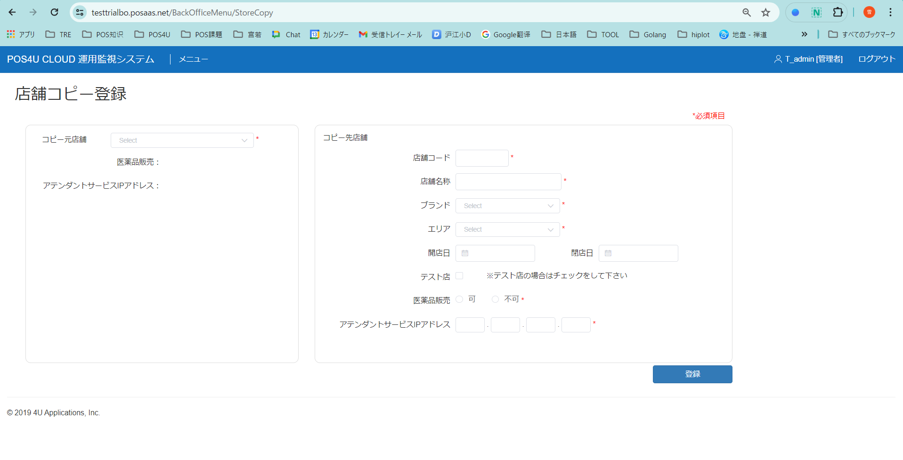
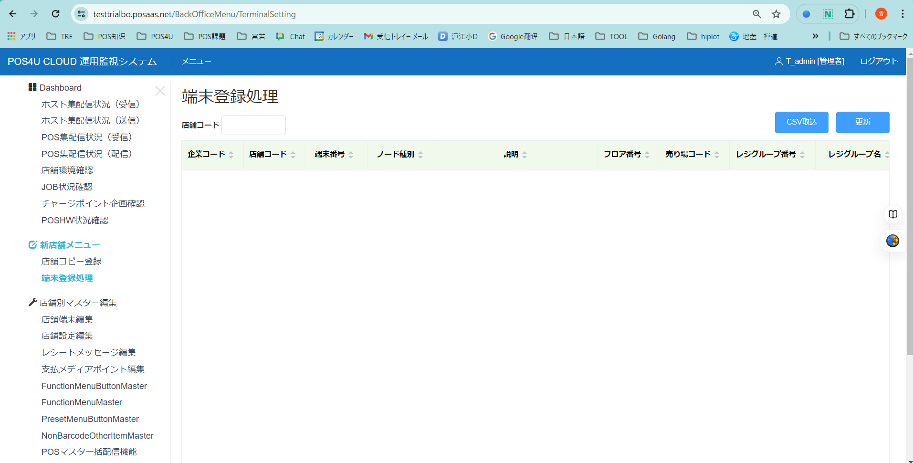

# 新店追加手順 （運用監視ツール）

①運用監視サイトの画面左の「新店舗登録画面」をクリックし、「店舗コピー登録」画面を開きます。   
②店舗コピー登録画面にてマスタをコピーしたい対象店舗を「コピー元店舗」として選択します。   
　コピー先店舗に対象店舗お情報を登録します。   
　「登録」ボタンを押下します。   
　　→バックグラウンドで店舗を動作させるためのマスタがコピーされます。 　　　　(AreaMaster,CashChangerCheckMaster,CashDenominationMaster,DiscountAutoItemMaster,EmployeeRoleMaster,FunctionMenuMaster,FunctionMenuButtonMaster,MDHierarchyLevelMaster,OperationLimitMaster,PaymentMaster,PaymentTicketBarCodeMaster,PaymentTicketMaster,SettingMaster,PointRankMaster,ReasonMaster) ,ReceiptMessageMaster,NonBarcodeOtherItemMaster,PresetMenuMaster,PresetMenuButtonMaster,NonBarcodeOtherItemCategoryMaster,ItemImageMaster   
　　　コピー処理の結果は運用監視サイトの「スケジュールJOB状況」画面から確認でいます。   
　※当処理の完了後、商品マスタ等の基幹差分取込みが動作し始めます。 

③運用監視サイトの画面左の「新店舗端末登録画面」をクリックし、「端末登録処理」画面を開きます。   
　※端末番号は店舗ごとに個別設定が必要なため、個別画面にて設定します。   
　※当画面は店舗の端末マスタを削除してエクセルの入力値で登録します。   
　　1レコードづつの追加・更新・削除は運用監視サイトの画面左の「店舗端末編集」を利用してください。   
④エクセルブック「Auto_make_nodemastercsv.xlsm」に新店の端末情報を入力し、「NodeMasterCsv作成」ボタンを押下します。   
　エクセルブックと同フォルダに「data.csv」ファイルが作成されます。   
⑤「端末登録処理」画面にて店舗コードに登録したい店舗コードを入力します。   
⑥「端末登録処理」画面にて「CSV取込」ボタンを押下し、④の「data.csv」を選択します。   
⑦取込ファイルの内容に問題なければ「更新」ボタンを押下します。

‌

運用監視ツール（新店舗コピー）画面

<1>店舗コピー登録画面

‌

<2>端末登録画面

‌

‌
