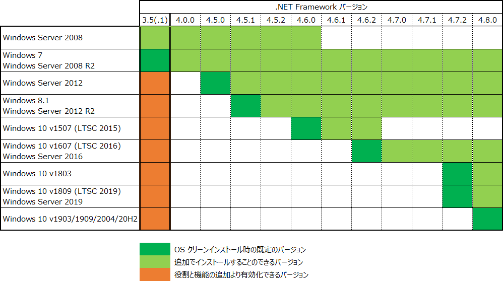
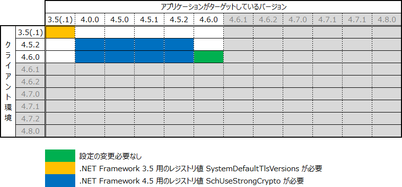
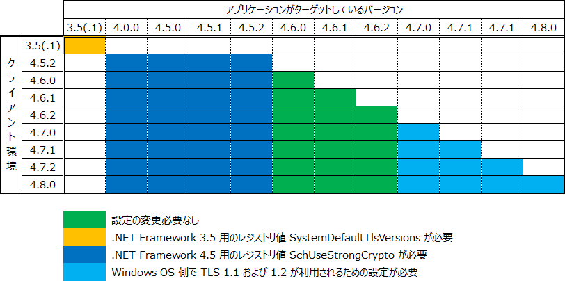
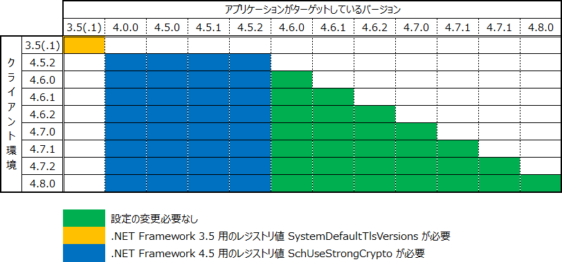
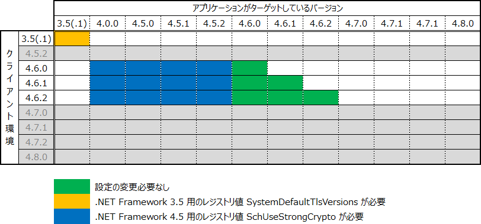
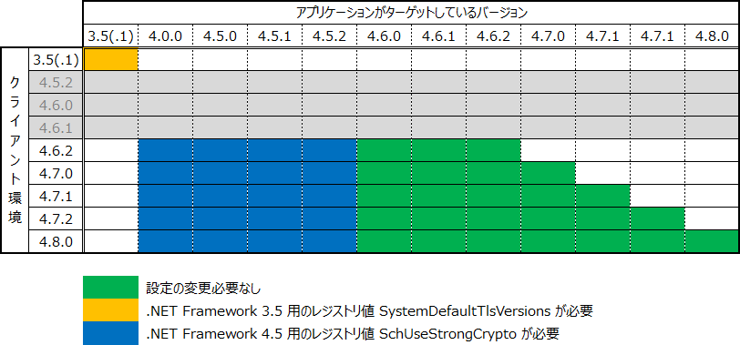
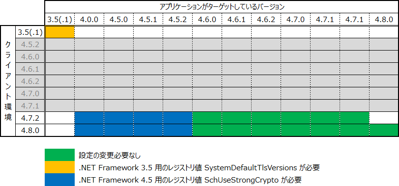
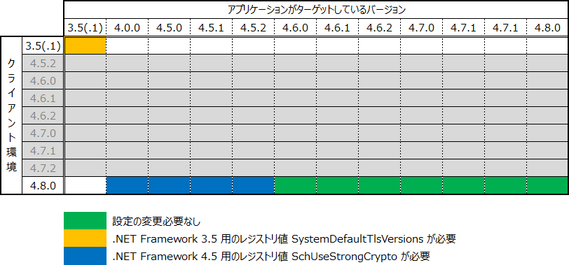

# .NET Framework で TLS 1.1 および TLS 1.2 を有効化する方法まとめ

## 1. TLS 1.1 および 1.2 に対応するうえでの考え方

---

.NET Framework で作成されたアプリケーションを TLS 1.2 (TLS 1.1) に対応させるには下記の点を考慮する必要があります。  
ご利用の OS が TLS 1.1 および 1.2 を利用できるかどうか、また、アプリケーションで独自に設定しているかどうか、により必要な対応が異なります。  
このため、まずは下記の観点で、ご利用対象の環境やアプリケーションについて理解することが第一歩となります。

* 対象の環境は OS として TLS 1.2 (TLS 1.1) を利用できるかどうか
* アプリケーション側で ServicePointManager.SecurityProtocol プロパティにすでに明示的に設定しているものがないか
* アプリケーションがターゲットしている .NET Framework のバージョンはいくつか
* 稼働対象の環境にインストールされている .NET Framework のバージョンはいくつか
* アプリケーションを改修することはできるか

各ポイントの詳細については次項以降をご覧ください。

‌

## 2. Windows OS の TLS 1.1 および 1.2 への対応状況

---

ご利用対象の Windows OS 自体が TLS 1.1 および 1.2 を利用することができない場合には、.NET Framework 側でいくら対応しても TLS 1.1 および 1.2 に対応することはできません。  
.NET Framework での対応の前に、**Windows OS 自体を TLS 1.1 および 1.2 を利用できるように構成する必要があります**。

**！ご注意ください！**  
Windows OS 自体が TLS 1.1 および 1.2 を利用することができない状態でアプリケーション側で TLS 1.1 および 1.2 が指定されると、アプリケーション実行時に例外が発生します。

### Windows Server 2008 SP2

既定の状態では OS として TLS 1.1 および 1.2 を**利用することができません**。  
.NET Framework での TLS 1.1 および 1.2 への対応の前に、事前に下記の更新プログラムを適用し、OS として TLS 1.1 および 1.2 を利用できるようにする必要があります。

> [_Windows Server 2008 SP2、Windows Embedded POSReady 2009、および Windows Embedded Standard 2009 に TLS 1.1 および TLS 1.2 のサポートを追加する更新プログラム_](https://support.microsoft.com/ja-jp/help/4019276/update-to-add-support-for-tls-1-1-and-tls-1-2-in-windows)

更新プログラム適用後、必要に応じて上記資料に記載のレジストリ値を設定します。

**2022/06/22 変更:** DisabledByDefault に設定する値を 1 から 0 へ訂正

```
[HKEY_LOCAL_MACHINE\SYSTEM\CurrentControlSet\Control\SecurityProviders\SCHANNEL\Protocols\TLS 1.1\Client]  
"DisabledByDefault"=dword:00000000  

[HKEY_LOCAL_MACHINE\SYSTEM\CurrentControlSet\Control\SecurityProviders\SCHANNEL\Protocols\TLS 1.2\Client]  
"DisabledByDefault"=dword:00000000  

[HKEY_LOCAL_MACHINE\SYSTEM\CurrentControlSet\Control\SecurityProviders\SCHANNEL\Protocols\TLS 1.1\Server]  
"DisabledByDefault"=dword:00000000  

[HKEY_LOCAL_MACHINE\SYSTEM\CurrentControlSet\Control\SecurityProviders\SCHANNEL\Protocols\TLS 1.2\Server]  
"DisabledByDefault"=dword:00000000  
```

**設定のポイント**  
クライアント OS として利用する場合 (任意のアプリケーションが別の Web サーバーに接続するような場合) には Client に設定します。  
サーバー OS として利用する場合 (Web サーバーのように接続を待ち受けるような場合) には Server に設定します。

### Windows Server 2008 R2 / Windows 7

OS としては TLS 1.1 および 1.2 を利用できますが、アプリケーション側より明示的に TLS 1.1 もしくは 1.2 を利用する指定がない限り利用されません。  
アプリケーション側からの指定がなくとも利用されるように構成するには、上記の Windows Server 2008 SP2 に記載したレジストリ値 (DisabledByDefault) を必要に応じて設定します。  
(参考) [TLS/SSL Settings](https://docs.microsoft.com/en-us/previous-versions/windows/it-pro/windows-server-2012-R2-and-2012/dn786418(v=ws.11))

### Windows Server 2012 / Windows 8.1 以降

OS として TLS 1.1 および 1.2 を利用でき、かつ、既定の状態で TLS 1.1 および 1.2 が利用されるように構成されています。  
追加で必要な設定はありません。

‌

## 3. .NET Framework で利用される既定のプロトコル バージョン

---

.NET Framework では、HttpWebRequest クラスなどを利用した通信において ServicePointManager.SecurityProtocol プロパティに指定されたプロトコル バージョンが利用されます。  
**プログラム上で明示的に指定されている場合は指定されたプロトコル バージョンが利用されます**が、指定されていない場合に利用される既定のプロトコル バージョンは下記のとおりです。  
.NET Framework の各バージョンごとに、TLS 1.1 および 1.2 への対応状況と併せてまとめました。

(2023/03/14 追記 ここから)  
なお、本記事の 1 で『アプリケーションがターゲットしている .NET Framework のバージョンはいくつか』と示したように、**バージョンについて大事なことは、端末にインストールされている .NET Framework ランタイムのバージョンではなく、対象の .NET アプリ開発時にターゲットとして選択する .NET Framework のバージョンであることにご注意ください。**[参考画面イメージはこちら](https://learn.microsoft.com/ja-jp/visualstudio/ide/visual-studio-multi-targeting-overview?view=vs-2022#select-a-target-framework-version)  
具体的には、本記事の 8 に示すそれぞれの表の横軸について、確認対象のアプリがどのターゲット バージョンなのかをもとにみていきます。  
(2023/03/14 追記 ここまで)

### .NET Framework 3.5 (3.5.1)

既定では TLS 1.1 および 1.2 は未対応  
プロパティの既定値は SSL 3.0 および TLS 1.0

### .NET Framework 4.5.2

TLS 1.1 / TLS 1.2 に対応済み  
プロパティの既定値は SSL 3.0 および TLS 1.0

### .NET Framework 4.6.x

TLS 1.1 / TLS 1.2 に対応済み  
プロパティの既定値は TLS 1.0、1.1 および 1.2

### .NET Framework 4.7.x

TLS 1.1 / TLS 1.2 に対応済み  
プロパティの既定値は SystemDefault となり、OS の TLS の設定状態に依存する

### .NET Framework 4.8.x

TLS 1.1 / TLS 1.2 に対応済み  
プロパティの既定値は SystemDefault となり、OS の TLS の設定状態に依存する

‌

## 4. .NET Framework 3.5 で TLS 1.1 および 1.2 を利用できるようにするための更新プログラム

---

.NET Framework 3.5 は既定の状態では TLS 1.1 および 1.2 を利用することができません。  
.NET Framework 3.5 で TLS 1.1 および 1.2 を利用できるようにするために下記の更新プログラムを適用する必要があります。  
※ 下記更新プログラムはそれ以降の更新プログラムで置き換えられていますので、セキュリティの観点では『Windows 10 および Windows Server 2016 の場合は OS 向けの最新のロールアップ』を、『それ以外の OS では .NET Framework 向けの最新の品質ロールアップ』を適用することをおすすめします。

**！ご注意ください！**  
更新プログラムを適用しない状態でアプリケーション側で TLS 1.1 および 1.2 が指定されると、アプリケーション実行時に例外が発生します。

### Windows Server 2008

[Support for TLS System Default Versions included in the .NET Framework 2.0 SP2 on Windows Vista SP2 and Server 2008 SP2](https://support.microsoft.com/en-us/help/3154517/support-for-tls-system-default-versions-included-in-the-net-framework)

### Windows Server 2008 R2 / Windows 7

[Support for TLS System Default Versions included in the .NET Framework 3.5.1 on Windows 7 SP1 and Server 2008 R2 SP1](https://support.microsoft.com/en-us/help/3154518/support-for-tls-system-default-versions-included-in-the-net-framework)

### Windows Server 2012

[Support for TLS System Default Versions included in the .NET Framework 3.5 on Windows Server 2012](https://support.microsoft.com/en-us/help/3154519/support-for-tls-system-default-versions-included-in-the-net-framework)

### Windows Server 2012 R2 / Windows 8.1

[Support for TLS System Default Versions included in the .NET Framework 3.5 on Windows 8.1 and Windows Server 2012 R2](https://support.microsoft.com/en-us/help/3154520/support-for-tls-system-default-versions-included-in-the-net-framework)  
※ 更新プログラムの適用には Windows 8.1 Update / Windows Server 2012 R2 Update (KB2919355) が事前に適用されている必要があります

### Windows 10 v1507 (LTSC)

Windows 10 v1507 環境向けに公開されている更新プログラムを適用します。  
※ 本記事執筆時点で、最も古い更新プログラムは下記の 2016 年 10 月に公開された更新プログラムです。下記以降の更新プログラムの適用をご検討ください。  
[2016 年 10 月 11 日 — KB3192440 (OS ビルド 10240.17146)](https://support.microsoft.com/ja-jp/help/4001772/windows-10-update-kb3192440)

### Windows 10 v1607 (LTSC) / Windows Server 2016

下記のいずれかの更新プログラム以降で対応されています。  
[2016 年 12 月 9 日 — KB3201845 (OS ビルド 14393.479)](https://support.microsoft.com/ja-jp/help/4004253/windows-10-update-kb3201845)  
[2016 年 12 月 13 日 — KB3206632 (OS ビルド 14393.576)](https://support.microsoft.com/ja-jp/help/4004227/windows-10-update-kb3206632)

### Windows 10 v1703 / Windows Server 2019 以降

.NET Framework 3.5 の機能を有効化した時点ですでに対応されています。  
追加で適用が必要な更新プログラムはありません。

‌

## 5. .NET Framework 3.5 で TLS 1.1 および 1.2 を既定値にするための方法

---

.NET Framework 3.5 は、SSL 3.0 および TLS 1.0 が既定で利用されるプロトコル バージョンです。  
既定値を変更するには、Windows OS 側で TLS 1.1 および 1.2 が利用されるよう構成し、かつ、.NET Framework 3.5 で TLS 1.1 および 1.2 を利用できるようにするための更新プログラムを適用したうえで各資料に記載の下記のレジストリ値を設定します。

下記のレジストリ値が設定されると Windows OS 側で構成しているプロトコル バージョンに従うようになります。  
Windows OS 側で TLS 1.1 および 1.2 が利用されるよう構成することで、.NET Framework 3.5 で利用されるプロトコル バージョンも TLS 1.0、TLS 1.1 および TLS 1.2 に変更されます。

```
[HKEY_LOCAL_MACHINE\SOFTWARE\Microsoft\.NETFramework\v2.0.50727]  
"SystemDefaultTlsVersions"=dword:00000001  
```

64 ビット OS の環境の場合は下記にも設定します。

```
[HKEY_LOCAL_MACHINE\SOFTWARE\Wow6432Node\Microsoft\.NETFramework\v2.0.50727]  
"SystemDefaultTlsVersions"=dword:00000001  
```

**設定のポイント**  
プログラム上で ServicePointManager.SecurityProtocol プロパティに明示的に任意のプロトコル バージョンを指定している場合は、上記のレジストリ値の設定の有無にかかわらずプログラムで指定したプロトコル バージョンが利用されます。

‌

## 6. .NET Framework 4.5.2 で TLS 1.1 および 1.2 を既定値にするための方法

---

.NET Framework 4.5.2 は、SSL 3.0 および TLS 1.0 が既定で利用されるプロトコル バージョンです。  
既定値を変更するには、下記のセキュリティ アドバイザリー 2960358 で公開されている更新プログラムを適用します。  
※ 下記更新プログラムはそれ以降の更新プログラムで置き換えられていますので、セキュリティの観点では『Windows 10 および Windows Server 2016 の場合は OS 向けの最新のロールアップ』を、『それ以外の OS では .NET Framework 向けの最新の品質ロールアップ』を適用することをおすすめします。

> [_Microsoft Security Advisory 2960358_](https://docs.microsoft.com/en-us/security-updates/securityadvisories/2015/2960358)  
> _(日本語訳)_ [_マイクロソフト セキュリティ アドバイザリ 2960358_](https://docs.microsoft.com/ja-jp/security-updates/securityadvisories/2015/2960358)

上記のセキュリティ アドバイザリーを適用すると下記のレジストリ値が構成され、.NET Framework 4.5.2 で利用されるプロトコル バージョンが TLS 1.0、TLS 1.1 および TLS 1.2 に変更されます。  
念のためレジストリ値が構成されているか確認し、万が一構成されていない場合は手動で構成します。

```
[HKEY_LOCAL_MACHINE\SOFTWARE\Microsoft\.NETFramework\v4.0.30319]  
"SchUseStrongCrypto"=dword:00000001  
```

64 ビット OS 環境の場合は下記にも設定します。

```
[HKEY_LOCAL_MACHINE\SOFTWARE\Wow6432Node\Microsoft\.NETFramework\v4.0.30319]  
"SchUseStrongCrypto"=dword:00000001  
```

**設定のポイント**  
プログラム上で ServicePointManager.SecurityProtocol プロパティに明示的に任意のプロトコル バージョンを指定している場合は、上記のレジストリ値の設定の有無にかかわらずプログラムで指定したプロトコル バージョンが利用されます。

‌

## 7. .NET Framework のサポート状況

.NET Framework 4.x 系は、4.5.2 以降がサポート対象です。  
稼働対象の環境にインストールするバージョンは可能な限り最新のバージョンとすることをご検討ください。

> [_.NET Framework サポート ライフサイクル ポリシーについて (2015 年 10 月)_](https://blogs.msdn.microsoft.com/visualstudio_jpn/2015/10/18/net-framework-201510/)  
> [_.NET Framework 4 を対象に作成したアプリケーションのサポートについて_](https://blogs.msdn.microsoft.com/jpvsblog/2015/07/22/net-framework-4-12388/)

### 各 OS 上での .NET Framework の既定のバージョン

OS ごとに既定でインストールされている .NET Framework のバージョンは下記の資料をご覧ください。  
OS によってはクリーンインストールした状態ですでにサポートが終了している状況もあり得るため、インストールすることのできる最新バージョンへの更新をご検討ください。

> [_.NET Framework Versions and Dependencies_](https://docs.microsoft.com/en-us/dotnet/framework/migration-guide/versions-and-dependencies)  
> _(日本語訳)_ [_.NET Framework のバージョンおよび依存関係_](https://docs.microsoft.com/ja-jp/dotnet/framework/migration-guide/versions-and-dependencies)

> [_Installation guide_](https://docs.microsoft.com/en-us/dotnet/framework/install/)  
> _(日本語訳)_ [_インストール ガイド_](https://docs.microsoft.com/ja-jp/dotnet/framework/install/)

### 各 OS 上でサポートされるバージョン

各 OS ごとにサポートされているバージョンは下表のとおりです。

各 OS 上でサポートされるバージョン
## 8. 各 OS ごとの対応方法

---

上記までの内容を踏まえたうえでの各 OS ごとの対応方法について下記にまとめました。  
なお、.NET Framework 3.5(.1) は、事前に **TLS 1.1 および TLS 1.2 に対応するための更新プログラムが適用されていることが前提** です。  
また、Windows Server 2008 は、事前に **OS 向けの TLS 1.1 および 1.2 に対応するための更新プログラムが適用されていることが前提** です。

### 各 OS 共通

何度も記載していますが、ServicePointManager.SecurityProtocol プロパティに明示的にプロトコル バージョンを指定している場合には、当プロパティに指定したプロトコル バージョンが利用されます。  
下表は当プロパティに TLS 1.2 を設定した場合の対応表になります。  

各 OS 共通
ServicePointManager.SecurityProtocol プロパティに明示的に指定していない場合の各 OS ごとの対応表は下記のとおりです。

### Windows Server 2008

**※ 前提条件 ※**  
Windows Server 2008 は、既定の状態では OS として TLS 1.1 および 1.2 を利用することができません。  
事前に **TLS 1.1 および 1.2 を利用できるようにするための更新プログラムの適用が必須** です。  

Windows Server 2008
### Windows Server 2008 R2 / Windows 7

**※ 前提条件 ※**  
Windows Server 2008 R2 / Windows 7 は OS としては TLS 1.1 および 1.2 を利用できますが、アプリケーション側より明示的に TLS 1.1 もしくは 1.2 を利用する指定がない限り利用されません。  
必要に応じて **アプリケーション側からの指定がなくとも TLS 1.1 および 1.2 が利用されるためのレジストリ値を設定します**。  

Windows 7 および Windows Server 2008 R2
### Windows Server 2012

‌

Windows Server 2012
### Windows Server 2012 R2 / Windows 8.1

‌

Windows 8.1 および Windows Server 2012 R2
### Windows 10 v1507 (LTSC 2015)

‌

Windows 10 v1507 (LTSC 2015)
### Windows 10 v1607 (LTSC 2016) / Windows Server 2016

‌

Windows 10 v1607 (LTSC 2016) および Windows Server 2016
### Windows 10 v1803

‌

Windows 10 v1803
### Windows 10 v1809 (LTSC 2019) / Windows Server 2019

‌

Windows 10 v1809 (LTSC 2019) および Windows Server 2019
### Windows 10 v1903 / v1909 / v2004 / v20H2

Windows 10 v1903 / v1909 / v2004 / v20H2
‌

参考：

<custom data-type="smartlink" data-id="id-0">https://jpdsi.github.io/blog/internet-explorer-microsoft-edge/dotnet-framework-tls12/</custom>
