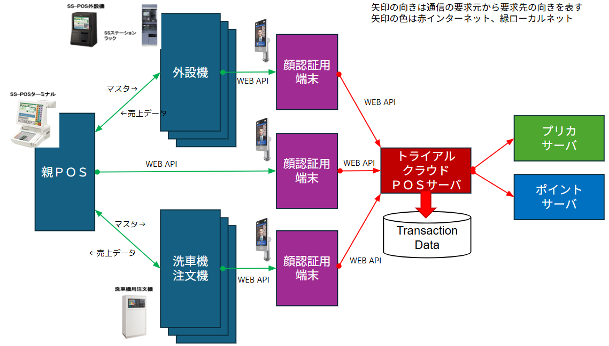

# ガソリンスタンドPOS

◆背景

* 西湊ショッピングセンター（仮称）ではトライアルカーズがガソリンスタンドを運営することになっている。概要は以下のとおり。
* コストコのガソリンスタンドをモデルとして、圧倒的な低価格を武器にした集客アイテムとすべくガソリンスタンドを運営する。
* ガソリンスタンドに用いるシステム（給油機・ＰＯＳ）は外部ベンダー（コストコのシステムを納入しているシャープからとなる模様）から調達する。
* 当該ガソリンスタンドではトライアルのプリペイドカードまたはポイントしか支払に使えないものとする（現金やクレジットの利用はできない。現金チャージ機もおかない）
* 従って、ガソリンを入れるためには会員認証が必要であるが、これは「顔認証」「スマホアプリのワンタイムバーコード」「プラスチックカード背面のバーコード＋ＰＩＮコード」で行えるものとなる。

‌

◆実現方針案

外設機（以降ではガソリンＰＯＳと表記）は、

* 顔認証の実施
* プリカサーバとの通信
* ポイントサーバとの通信
* トライアル社側で必要なトランザクションデータをトライアル社POSサーバに連携

を、「顔認証用端末と通信することで実現」する。

‌
