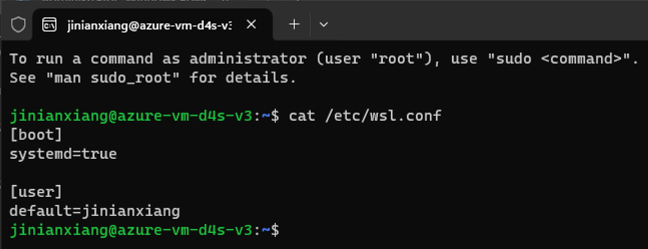
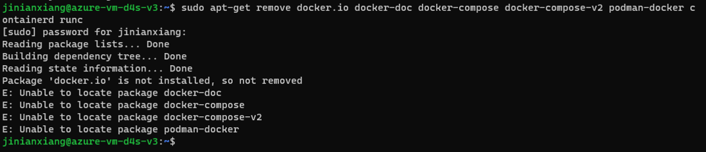
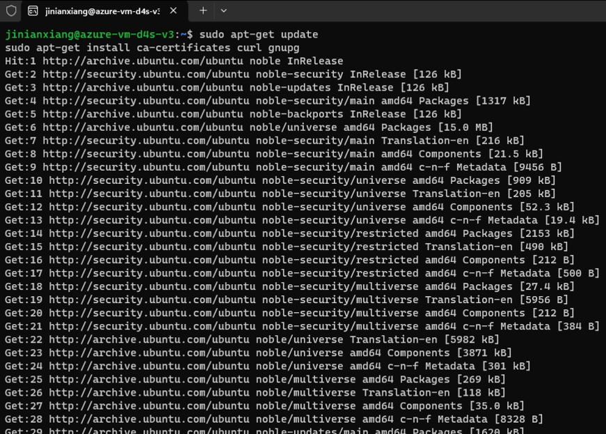
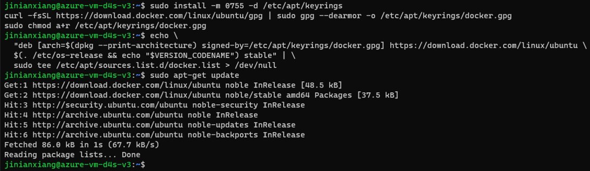
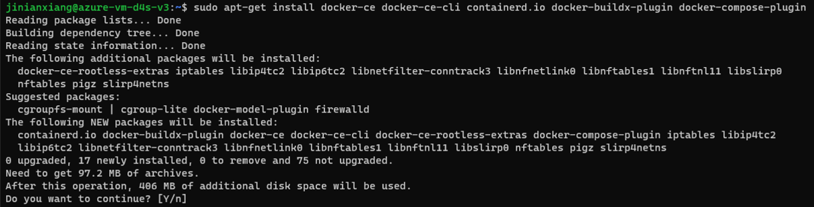
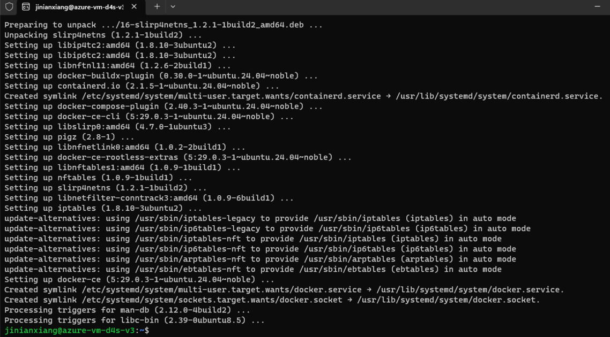
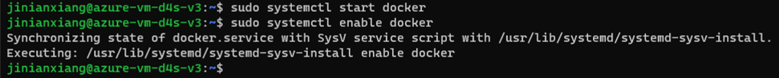
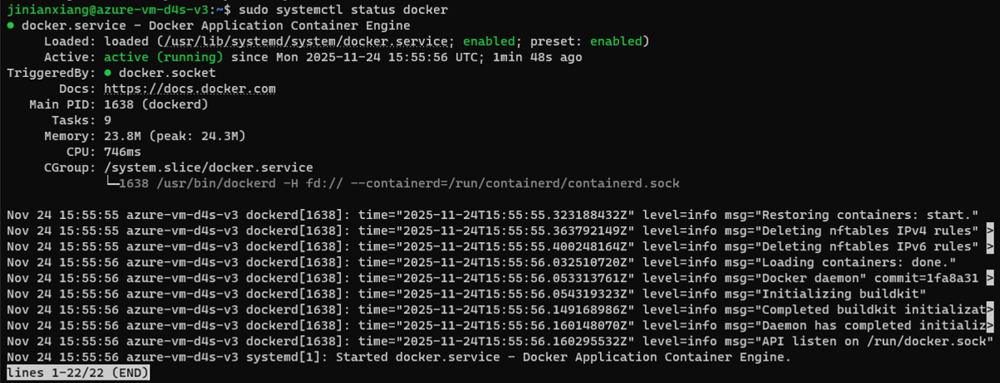
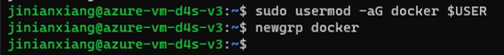

# 02. Windows上のWSL2(Ubuntu)でDockerインストール手順

Windows 上の WSL 2 環境 (Ubuntu) に、**Docker Desktop (Windows アプリ) を使用せず**、Ubuntu 内部に直接 **Docker Engine** をインストールする詳細なチュートリアルです。

この方法は、Docker Desktop の商用ライセンス制限を受けず（完全無料）、実際の Linux サーバーに近い環境で運用できるメリットがあります。

---

‌

### ⚠️ 最重要：Systemd の有効化確認

‌

Docker はサービスの管理に `systemd` を強く依存しています。最近の WSL 2 はサポートしていますが、有効になっているか確認が必要です。

1. Ubuntu のターミナルを開きます。（スタートメニューからUbuntu検索）

    
2. 以下のコマンドで `wsl.conf` ファイルの中身を確認します。

    ```
    cat /etc/wsl.conf
    ```


3. **確認結果**:

    * **以下の記述があれば**、有効になっています。「ステップ 1」へ進んでください。
    
        ```
        [boot]
        systemd=true
        ```
    * **何も表示されない、またはファイルがない場合**、以下のコマンドを実行して設定を追加してください。
    
        ```
        sudo sh -c 'echo "[boot]\nsystemd=true" >> /etc/wsl.conf'
        ```
    * 設定追加後は必ず WSL を再起動する必要があります:
    
        Windows PowerShell に戻り、wsl --shutdown を実行してから、再度 Ubuntu を開いてください。

    
    

---

‌

### ステップ 1：古いバージョンの削除 (競合回避)

‌

Ubuntu に標準で含まれる古いパッケージと競合しないよう、まずはクリーンアップを行います。

```
sudo apt-get remove docker.io docker-doc docker-compose docker-compose-v2 podman-docker containerd runc
```


  
_(パッケージが見つからないという表示が出ても問題ありません。そのまま進めてください)_

---

‌

### ステップ 2：Docker 公式リポジトリの設定

‌

Ubuntu 標準の `apt install docker` で入るバージョンは古いため、Docker 公式の最新版を取得できるように設定します。

1. **インデックスの更新と必須ツールのインストール**:

    ```
    sudo apt-get update
    sudo apt-get install ca-certificates curl gnupg
    ```


‌

2. **Docker 公式 GPG キーの追加**:

    ```
    sudo install -m 0755 -d /etc/apt/keyrings
    curl -fsSL https://download.docker.com/linux/ubuntu/gpg | sudo gpg --dearmor -o /etc/apt/keyrings/docker.gpg
    sudo chmod a+r /etc/apt/keyrings/docker.gpg
    ```
3. リポジトリリストへの追加:

    (以下のコードブロックをすべてコピーして貼り付け、実行してください)


    ```
    echo \
      "deb [arch=$(dpkg --print-architecture) signed-by=/etc/apt/keyrings/docker.gpg] https://download.docker.com/linux/ubuntu \
      $(. /etc/os-release && echo "$VERSION_CODENAME") stable" | \
      sudo tee /etc/apt/sources.list.d/docker.list > /dev/null
    ```
4. **インデックスの再更新**:

    ```
    sudo apt-get update
    ```


---

‌

### ステップ 3：Docker Engine のインストール

‌

以下のコマンドで、Docker 本体と関連プラグイン（Docker Compose 含む）をインストールします。

```
sudo apt-get install docker-ce docker-ce-cli containerd.io docker-buildx-plugin docker-compose-plugin
```

Yを入力してEnter押下

---

‌

### ステップ 4：Docker サービスの起動

‌

インストール直後はサービスが停止している場合があるため、手動で起動します。

```
sudo systemctl start docker
sudo systemctl enable docker
```

_(enable を実行することで、次回 Ubuntu 起動時にも自動で Docker が立ち上がります)_


**ステータスの確認**:

```
sudo systemctl status docker
```


緑色の文字で `Active: active (running)` と表示されていれば成功です。確認画面は `q` キーで閉じます。

---

‌

### ステップ 5：sudo なしで Docker を使えるように設定 (推奨)

‌

デフォルトでは `docker` コマンドの実行に `sudo` が必要です（例: `sudo docker ps`）。毎回入力するのは手間なので、現在のユーザーを docker グループに追加します。

1. **グループへの追加**:

    ```
    sudo usermod -aG docker $USER
    ```
2. **グループ設定の反映**（再起動不要）:

    ```
    newgrp docker
    ```


‌

---

‌

### ステップ 6：最終確認（非必須）

‌

Hello World コンテナを実行して、正しく動作するかテストします。

```
docker run hello-world
```

**期待される出力**:

```
Plaintext
```

```
Hello from Docker!
This message shows that your installation appears to be working correctly.
...
```

これが表示されれば、構築完了です！

---

‌

### 📝 よくある質問とトラブルシューティング

‌

1. **エラー "Cannot connect to the Docker daemon at unix:///var/run/docker.sock..."**

    * **原因**: Docker サービスが起動していません。
    * **解決策**: 冒頭の「Systemd の有効化確認」を行っているか確認し、`sudo systemctl start docker` を実行してください。それでもだめなら `sudo service docker start` を試してください。
    
2. **イメージのダウンロードが遅い**

    * 中国国内などネットワーク制限がある環境では、ミラーサイトの設定が必要です。
    * `/etc/docker/daemon.json` ファイルを作成/編集し、適切なミラー（例：DaoCloudなど）を設定してください。
    * 設定後は `sudo systemctl restart docker` で再起動が必要です。
    
3. **Docker Desktop と競合しますか？**

    * **はい、競合します**。もし以前に Windows 版の Docker Desktop をインストールし、WSL 連携をオンにしていた場合は、設定で Ubuntu との連携をオフにするか、Docker Desktop 自体をアンインストールすることを推奨します。
    

---

By Gemini3 pro

2025/11/22 9:53

Azure VMのWin 11 Pro (version 25H2 OS Build 26200.7171）で検証済(by jinianxiang)

‌
