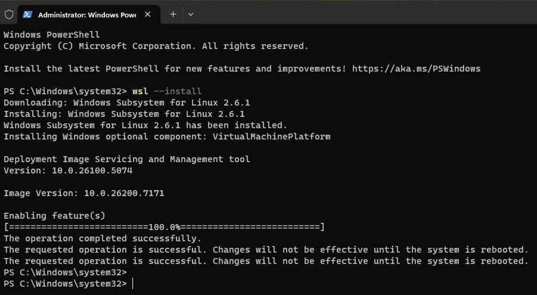
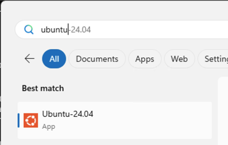
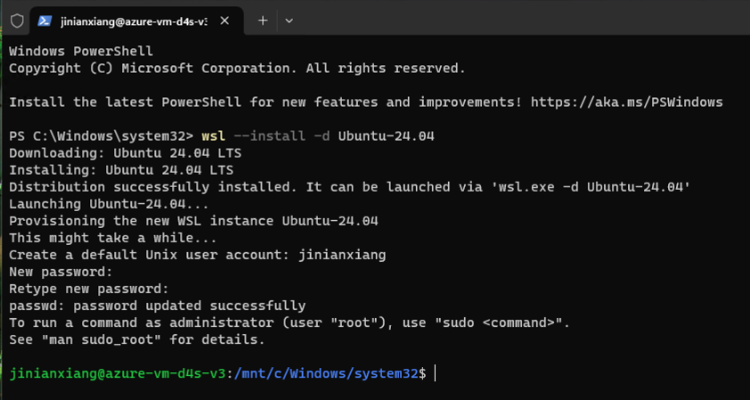
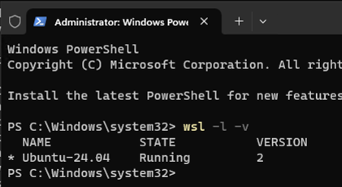

# 01. WindowsでWSL2(Ubuntu)のインストール手順

Windows 10 または Windows 11 で、WSL 2 (Windows Subsystem for Linux 2) を使用して Ubuntu をインストールするための詳細なチュートリアルです。

---

‌

### 📋 チュートリアル概要

‌

1. **環境確認**（最も重要なステップです。失敗の多くはここが原因です）
2. **WSL 2 と Ubuntu の一括インストール**（推奨する方法）
3. **初期設定**（ユーザー名とパスワード）
4. **インストール結果の検証**
5. **よくある質問とトラブルシューティング**

---

‌

### ステップ 1：環境確認 (必須)

‌

作業を始める前に、PCが以下の2つの必須条件を満たしていることを必ず確認してください。

‌

#### 1. Windows バージョンの確認

‌

WSL 2 には新しいバージョンの Windows が必要です。

* **確認方法**:

    1. `Win + R` キーを押し、`winver` と入力して Enter キーを押します。
    2. 表示されたウィンドウを確認します。
    
        * **Windows 11**: 完全にサポートされています。
        * **Windows 10**: バージョン **2004** 以上（OS ビルド **19041** 以上）である必要があります。
        
    

‌

#### 2. CPU 仮想化が有効か確認

‌

WSL 2 は軽量な仮想マシンであるため、CPU の仮想化技術が必須です。

* **確認方法**:

    1. タスクバーの何もないところを右クリックし、\*\*「タスク マネージャー」\*\*を選択します。
    2. 上部の\*\*「パフォーマンス」**タブをクリックし、左側の**「CPU」\*\*を選択します。
    3. 右下の領域で\*\*「仮想化」\*\* (Virtualization) を探します。
    4. 状態が\*\*「有効」\*\* (Enabled) になっている必要があります。
    

> **❌ もし「無効」と表示されている場合**: PCを再起動し、BIOS/UEFI 設定（通常は起動時に F2, Del, または F12 を連打）に入り、`Intel Virtual Technology` または `SVM Mode` (AMD) を `Enabled` に設定する必要があります。

---

‌

### ステップ 2：WSL 2 と Ubuntu のインストール

‌

現在の Windows バージョンでは、複雑な手順は不要で、コマンド1つで自動インストールが可能です。

‌

#### 1. 管理者としてターミナルを開く

‌

1. Windows の「スタート」ボタンを右クリックします。
2. **「Windows PowerShell (管理者)」** または **「ターミナル (管理者)」** を選択します。

‌

#### 2. インストールコマンドの実行

‌

ターミナルに以下のコマンドを入力し、Enter キーを押します。

```
wsl --install
```

* **このコマンドは自動的に以下を実行します**:

    1. 必要な Windows 機能（WSL と 仮想マシン プラットフォーム）を有効化。
    2. 最新の Linux カーネルをダウンロードしてインストール。
    3. WSL 2 をデフォルトバージョンに設定。  
        
      実行イメージ：
    


‌

#### 3. PC の再起動

‌

ターミナルに「操作は正常に完了しました」や「再起動が必要です」と表示されたら、変更を適用するために**必ず PC を再起動してください**。

---

‌

### ステップ 3：Ubuntu の初期設定

‌

1. **自動起動**: 再起動後、通常は Ubuntu のターミナルウィンドウが自動的に立ち上がります。もし立ち上がらない場合は、スタートメニューで "Ubuntu" を検索して開いてください。  

    

      
    検索の結果がなければ、下記のコマンド実施して、指定バージョンのUbuntuをインストールしてください


    ```
    wsl --install -d Ubuntu-24.04
    ```


2. **インストール待機**: 初回起動時は `Installing, this may take a few minutes...` と表示されます。1〜5分ほどお待ちください。
3. **アカウント設定**:

    * **Enter new UNIX username**: 希望するユーザー名を入力し（小文字のみ推奨、例: `john`）、Enter を押します。
    * **New password**: パスワードを入力します。**注意：パスワード入力中、画面にはアスタリスク（\*）などの文字は一切表示されません。これは Linux のセキュリティ仕様です。そのまま入力して Enter を押してください。**
    * **Retype new password**: 確認のためもう一度パスワードを入力します。
    

**緑色**の `username@computername:~$` というプロンプトが表示されれば、Ubuntu のインストールは成功です！

---

‌

### ステップ 4：インストール環境の検証

‌

古い WSL 1 ではなく、高性能な WSL 2 で動作しているかを確認します。

**Windows PowerShell**（Ubuntu のウィンドウではありません）に戻り、以下を入力します。

```
wsl -l -v
```

**期待される出力**:

```
  NAME            STATE           VERSION
* Ubuntu-24.04    Running         2
```


* **VERSION** 列が **2** になっていることを確認してください。
* もし **1** と表示されている場合は、下の「よくある質問」を参照してください。

---

‌

### ステップ 5：基本操作とトラブルシューティング

‌

#### 1. Windows から Ubuntu のファイルにアクセスするには？

‌

Windows エクスプローラーのアドレスバーに以下を入力して Enter を押します。

\\\\wsl$

これで Ubuntu のファイルシステムフォルダが表示されます。

‌

#### 2. Ubuntu から Windows のファイルにアクセスするには？

‌

Windows のドライブは `/mnt` ディレクトリにマウントされています。

* Cドライブ: `/mnt/c/`
* Dドライブ: `/mnt/d/`

‌

#### 3. よくあるエラーと解決策

‌

* **エラー: WslRegisterDistribution failed with error: 0x80370102**

    * **原因**: BIOS で仮想化が有効になっていません。
    * **解決策**: ステップ 1 を参照し、BIOS で仮想化技術をオンにしてください。
    
* **インストール後の VERSION が 1 と表示される**

    * **原因**: インストール時にカーネルコンポーネントが古かった可能性があります。
    * **解決策**: PowerShell で `wsl --set-version Ubuntu 2` を実行して強制的に変換します。
    
* `wsl --install` **が反応しない、またはヘルプ情報しか表示されない**

    * **原因**: Windows のバージョンが少し古いか、すでに一部のコンポーネントがインストールされている可能性があります。
    * **解決策**: Powershellで手動で Ubuntu を指定してインストールを試みてください。
    
        ```
        wsl --install -d Ubuntu-24.04
        ```
    

---

by Gemini 3 pro

2025/11/22 9:47

‌

Azure VMのWin 11 Pro (version 25H2 OS Build 26200.7171）で検証済(by jinianxiang)
