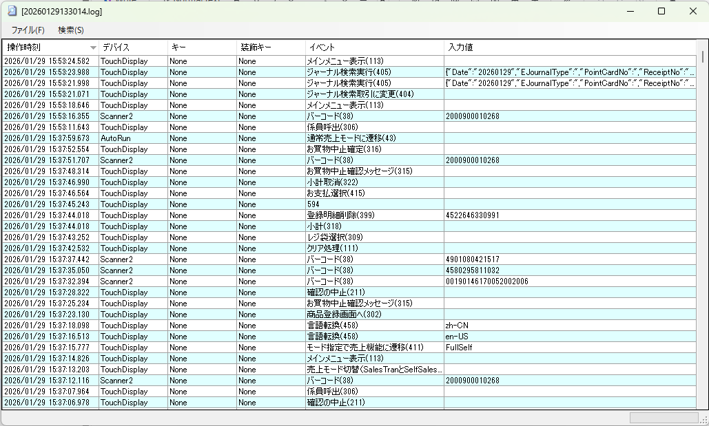

# インシデント調査

■操作ログ確認Tool（最終更新日：2026/02/06）

<custom data-type="smartlink" data-id="id-0">https://drive.google.com/drive/folders/19-Vz-DzaeuxICGPs59tyVrAB9KdXCDc0</custom> 

１）利用方法

RecordFileViewer.zipを解凍し、RecordFileViewer.exeを実行し、取得した操作ログをツールにドラッグ＆ドロップする。

２）更新説明  
動作説明用の RecordFileViewer_Event.tsvファイルについては[イベント管理のPage](https://retailai.atlassian.net/wiki/spaces/POSSYS/pages/2970550410)と紐づけたうえで更新する必要があります。

‌

‌

‌

‌
