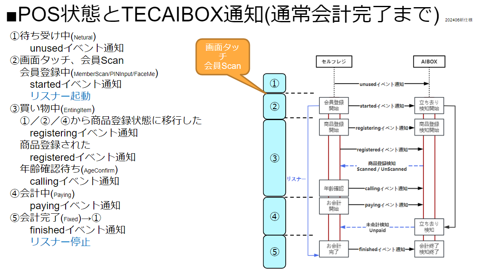

# TCP仕様書（廃止）

### POSとTEC防犯PKGとの通信シーケンス概要は下記となる

‌

### APOSとTEC防犯PKGとの通信APIについて

■前提

・POS-AI Box間はTCPソケット通信

・JSON形式の文字列をやり取り

■POSイベント情報　IF仕様

| フィールド名 | タイプ | メッセージの内容 |
| --- | --- | --- |
| time | str | 検出日時 ISO8601形式 （YYYY-MM-DDTHH:mm:ss.sss+9:00） |
| pos | int | 端末ID |
| source | str | ”terminal” |
| tid | str | 取引ID 現在時刻から13桁の数字の文字列を生成し取引IDとする 取引開始時に取引IDを生成し、取引完了まで同一のIDを使用する（MMDDhhmmsssss） |
| action | str | イベントタイプ（詳細次ページ） |
| price | int | 登録商品金額（詳細次ページ）該当しないイベントタイプの場合は出力しない |
| items | int | 登録商品点数（詳細次ページ）該当しないイベントタイプの場合は出力しない |
| total_price | int | 合計金額（詳細次ページ）該当しないイベントタイプの場合は出力しない |
| total_items | int | 合計個数（詳細次ページ）該当しないイベントタイプの場合は出力しない |
| note | str | 付加情報（詳細次ページ）該当しないイベントタイプの場合は出力しない |

■行動検知イベント　IF仕様 

| **フィールド名** | **タイプ** | **メッセージの内容** | **例** |
| --- | --- | --- | --- |
| time | str | iso8601準拠の時間。timezoneはJST。イベント送信時の時刻。 タイムゾーンの表記もする。 | 1990-01-01T00:00:00.000+09:00 |
| pos | int | POS番号。conf/\_default/GlobalSettings.yamlに書かれているpos_idが入る。 | 1 |
| source | str | イベント送信元。AI Box。 | “image”固定 |
| tid | str | POSイベントから受信した取引ID | MMDDhhmmsssss |
| type | str | 通知内容の分類 | ※送信する文字列：文字の意味　で以下に種類を記載。 action：行動イベント notification：通知イベント |
| name | str | イベントの名前 | ※送信する文字列：文字列の意味　で以下に種類を記載。 ScannedEvent   ：商品が正常に袋詰めされた UnscannedEvent ：商品がスキャンせずに袋詰めされた PaidEvent ：正常に会計を終了した UnpaidEvent ：未会計のまま立ち去った BasketEmptyEvent ：カゴが空だった BasketNotEmptyEvent ：カゴが空ではなかった StoredVideoEvent ：動画ファイルの保存が完了した MonitoringEvent ：死活監視用イベント |
| confidence | float | イベントの信頼度。 BasketEmptyEvent、BasketNotEmptyEvent以外はダミーで1.0の値が入る。BasketEmptyEvent、BasketNotEmptyEventは確率値として1.0以下、0.5より大きい値が入る。 | 1.0 |
| description | str | イベントの説明。  
nameと1対1で対応。  
nameと同様の内容だが、ログからどのような行動を検知したか把握しやすくする  
ために、イベントを説明するフィールドを持たせる(デバッグ用)。 | ※name field:送信する文字列 で以下に種類を記載。  
ScannedEvent :【正常】商品を登録しました  
UnscannedEvent :【不正】未登録の商品があります  
PaidEvent :【正常】会計を終了しました  
UnpaidEvent :【不正】未会計のまま立ち去りました  
BasketEmptyEvent :【正常】カゴは空です  
BasketNotEmptyEvent :【不正】カゴは空ではありません  
StoredVideoEvent :【通知】動画ファイルの保存が完了しました  
MonitoringEvent :【通知】不正検知プログラムの状態を受信しました |
| user-image | str | 使用者を確認するための画像 jpeg圧縮したバイト列をbase64で変換した文字列 | ※該当しないイベントの場合はnull文字列とする |
| fraud-image | str | 不正を確認するための画像 jpeg圧縮したバイト列をbase64で変換した文字列 | ※該当しないイベントの場合はnull文字列とする |
| filepath | str | 切取った不正動画のファイル名 ※動画ファイルの命名規則はPOS番号とイベント名とUnix時間(ミリ秒)から  
なる文字列とする  
※動画ファイルを保存するXavier共有フォルダのディレクトリは事前に設定ファイ  
ルで設定できるものとする | 01_19900101_000000.000_UnscannedEvent.mp4  
(※時刻例1990-01-01T00:00:00.000)  
※01(POS番号2桁)_(アンダーバー)YYYYMMDD_hhmmss.fff(日時)_(ア  
ンダーバー)UnscannedEvent(イベント名).mp4  
※現時点(9/13)ではイベント名にはnameフィールドで定義した以下3つが入る可  
能性があります(PoC向けの実装\_動画を後から解析するため)  
・UnscannedEvent ・UnpaidEvent ・BasketNotEmptyEvent  
※該当しないイベントの場合はnull文字列とする。  
※また、不正発生時のイベントに記載されたファイル名と、そのイベントと関連する動  
画保存完了通知時のイベントに記載されたファイル名(動画名)は同一のものとす  
る。 |
| devicestatus | int | 死活監視用。(現時点では死活監視にのみ使用する想定。) ※死活監視用通知は例えば300秒(5分)毎にEPHからこのフォーマットにし  
たがって、通知メッセージを送信する。  
この通知する間隔300秒(5分)は設定ファイルで変えられるようにする | 送信するイベント名:数値の意味 で以下に種類を記載  
0:該当しないイベントの場合  
1:不正検知プログラム動作中 |

‌

‌
