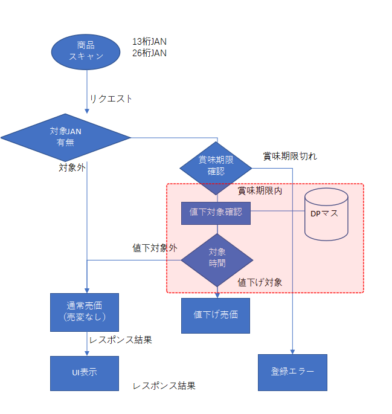

# ダイナミックプライシング

‌

### ■　条码构造

商品条码分为两类：

１）13位以内商品条码（JAN）

２）26位条码

构造：13桁商品ｺｰﾄ① + 6桁製造月日時② + 6桁賞味月日時③ + 1桁C/D④

备注：

④ 按照 CheckDigitTypes.CheckDigitM10W31（Mod10，权重3-1）方式计算

‌

### ■　26位条码中的年份计算规则

由于 26 位条码中的制造月日時、赏味月日時不直接包含年份，因此需要结合当前月（扫描时点）计算「製造年」与「賞味年」。

a. 製造月 ≤ 賞味月的情况下

若 製造月 ≤ 現在月  
→ 製造年 = 現在年  
→ 賞味年 = 現在年

若 製造月 > 現在月  
→ 製造年 = 現在年 - 1  
→ 賞味年 = 現在年 - 1

  b. 製造月 > 賞味月的情况下

若 製造月 ≤ 現在月  
→ 製造年 = 現在年  
→ 賞味年 = 現在年 + 1

若 製造月 > 現在月  
→ 製造年 = 現在年 - 1  
→ 賞味年 = 現在年

‌

补充： 期限切れ判定

按上述逻辑算出赏味期限（年月日）后，与当前时间（年月日）比较：

当前时间 > 赏味期限  → 判定为「期限切れ」错误，否则→ 可继续进行折扣企画判定

‌

### ■　DynamicPricingMaster企画表

| No. | Column Name | Description | Data Type | Precision,Scale | NotNull | Identity  
(SeedIncrement) | Primary Key | Foreign Key | Note |
| --- | --- | --- | --- | --- | --- | --- | --- | --- | --- |
| 1 | CompanyCode | 企業コード | nvarchar | 10 | Y |  | 1 |  |  |  |
| 2 | StoreCode | 店舗コード | nvarchar | 10 | Y |  | 2 |  |  |  |
| 3 | ItemCode | 商品コード | nvarchar | 26 | Y |  | 3 |  |  | \[dbo\].\[ItemMaster\]のItemCode |
| 4 | ManufacturedDateFrom | 製造日時From | nvarchar | 10 | Y |  | 4 |  |  |  |
| 5 | ManufacturedDateTo | 製造日時To | nvarchar | 10 | Y |  | 5 |  |  |  |
| 6 | DiscountStartDateTime | 値引開始日時 | datetime2 |  | Y |  | 6 |  |  |  |
| 7 | DiscountEndDateTime | 値引終了日時 | datetime2 |  | Y |  |  |  |  |  |
| 8 | DiscountType | 値引タイプ | nvarchar | 2 | Y |  |  |  |  | 00：値引、01：割引、02：価格指定 |
| 9 | DiscountValue | 値引値 | int |  | Y |  |  |  |  |  |

## 企画判定规则

１）13位以内商品条码

使用商品コード匹配 DynamicPricingMaster，

若当前时刻在企画有效期间内（DiscountStartDateTime ～ DiscountEndDateTime）、则适用对应的企画（DiscountType / DiscountValue）；不满足条件时，按商品原价售出。

‌

2）26位商品条码条码

从条码中解析商品コード（前13位）、计算出制造日期时间、赏味日期时间，并推定实际年月。

* 若已超过赏味期限 → 返回期限切れ错误
* 未过期时：

    * 制造日期时间在指定范围内（ManufacturedDateFrom ～ ManufacturedDateTo）
    * 且当前时刻在企画有效期间内（DiscountStartDateTime ～ DiscountEndDateTime）
    

满足上述条件时，则适用对应的企画（DiscountType / DiscountValue）；不满足条件时，按商品原价售出。
