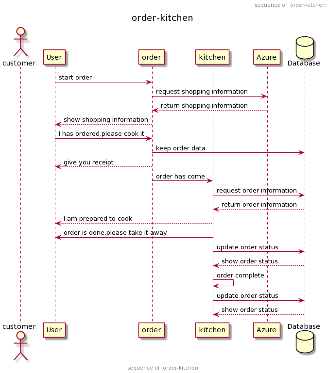

# 02 詳細設計_キッチン

## 1. ER図

\

## 2. ログ定義書

\

## 3. テーブルレイアウト

[キッチン_テーブルレイアウト](https://docs.google.com/spreadsheets/d/1bzjF9w5sH4oCApTH_PIqdWqEWleyOgue/edit?gid=1409829833#gid=1409829833)

最後更新日付：2019/9/11

## 4. API仕様書

[オーダー+キッチン_API設計書](https://docs.google.com/spreadsheets/d/1n1bTMU2NHmKhCP40l0GdYvDWoMyxC_z5/edit?gid=1715315766#gid=1715315766)

[バイオーダー_API設計書(Android用)](https://docs.google.com/spreadsheets/d/1ylMY0nb9rITJid3xnlHODYuSkaIqO8Ii/edit?gid=1384819914#gid=1384819914)

最後更新日付：2019/9/6

## 5. シーケンス図

