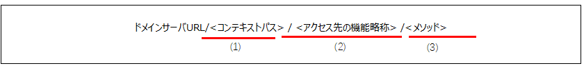

# 3.2バックエンド処理方法

■ 処理方式概要 \
　フォロン(VUE)とバックエンド(API)分離方式を採用する \
\
\
■ HTTPメソッドの使い分け \

|              |                  |
|--------------|------------------|
| HTTPメソッド | 方針             |
| GET          | DBからの情報取得 |
| POST         | DBへの登録       |

 \
\
■ 二重サブミット防止 \
　フォーム送信の場合、フロントエンドとバックエンドは繰り返し送信を個別に検証する必要があります \
\
■ URL設計 \
　⇒ URL設計概要 \

　本システムでの選択基準を以下に示す。 \

<table>
<tbody>
<tr>
<th>マッピング手法</th>
<th>理由</th>
</tr>
<tr>
<td>ルーティングアダプタ</td>
<td>"RESTful API の URL の設計は下記となります。 
・ラクダの命名方法を使用する 
・「/」は機能の階層をします。原則３階層まで定める 
・末尾にスラッシュ区切り記号 ""/"" を含めないでください"</td>
</tr>
</tbody>
</table>

 \
　⇒ URL設計詳細 \
　URLとControllerの対応付けおよびURL構成は以下の通り。\

<table>
<tbody>
<tr>
<th> 
</th>
<th>URL要素 </th>
<th>内容</th>
</tr>
<tr>
<td>(1)</td>
<td>&lt;コンテキストパス&gt;</td>
<td>
複数のシステムがドメイン名を共有する場合、プロジェクトに均一のプレフィックスを付ける

arcGIS、baapi、API-Atelier
</td>
</tr>
<tr>
<td>(2) </td>
<td>&lt;アクセス先の機能略称&gt;</td>
<td>コントロールの業務プレフィックス</td>
</tr>
<tr>
<td>(3) </td>
<td>&lt;メソッド&gt;</td>
<td>メソッド名で定義される。</td>
</tr>
</tbody>
</table>

\
 \
\
 
