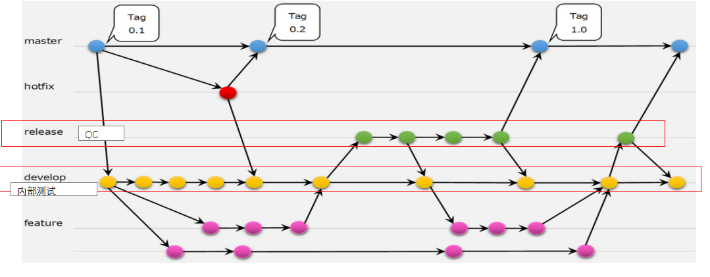

# 8.1.Gitフロー

### 流程：

#### **1. 正常功能开发（Feature → Develop）**

- 在 Feature 分支开发新功能。

- 开发自测通过后，创建 Pull Request (PR) 并进行 内部代码审查。

- 审查通过后，合并到 Develop 分支,进行单体测试以及bug修复。

#### **2. 最终测试（结合・回归・性能测试）（Develop → Release）**

- Develop → Release 单体测试通过后 创建 PR，并进行公司级代码审查，提前发现技术是否有明显缺陷

- 在 release 分支进行最终测试

（技术审核放在最终测试阶段，如果技术审核放到最后，一旦却下，对上线有风险所以放在最终测试阶段）

#### **3. 发布（Release → Master）**

- **测试以及代码审查通过后，合并 Release 分支到 Master 分支，确保 Master 分支始终保持稳定的最新代码。**

### **一、开发分支代码提交（内部审核） Feature → Develop**

------------------------------------------------------------------------

------------------------------------------------------------------------

commit：task#任务号 comment

feature_yyyyMMdd_功能描述\
feature_20231106_pick_detail\
\

### **二、PR（Pull Request）方式提交(公司内代码审核) Develop → Release**

****请在代码评审会议中确认 公司代码审核者****

------------------------------------------------------------------------

------------------------------------------------------------------------

**PR 描述应该包括以下关键点：**

1 变更内容（What）

- 详细描述 PR 主要做了什么改动。
- 提及涉及的代码模块或影响范围。

2 变更原因（Why）

- 为什么要进行这些改动？
- 解决了什么问题，或者带来了什么优化？

3 影响范围（Impact）

- 是否影响了已有的功能？
- 是否有兼容性问题？
- 是否需要额外的配置或数据库变更？

\

\

**例子**

------------------------------------------------------------------------

------------------------------------------------------------------------

**PR 标题 新增订单导出功能**

\### 变更内容（What） 

      - 在 \`OrderService\` 中新增 \`exportOrders()\` 方法，支持导出订单数据为 Excel

      - 在前端 \`OrderPage.vue\` 页面新增导出按钮

      - 增加单元测试，覆盖率达 95%

\### 变更原因（Why）

     - 业务需求：客户希望能够导出订单数据进行分析

     - 之前只能手动复制粘贴，效率较低

\### 影响范围（Impact）

    - 影响 \`OrderService\` 和 \`OrderPage.vue\`

    - 需要安装 \`xlsx\` 依赖库

    - 预计不会影响现有功能
