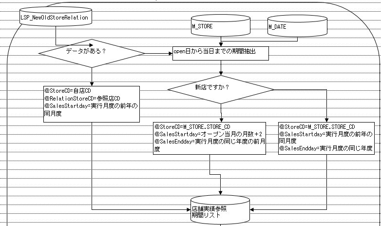

# チャンネルマスタ加工(廃棄)-バッチ処理

### １．目的

端末設定データからチャンネルマスタを加工する、値下げ管理システムでマスタを利用する

### ２．実行時間・頻度：　5分1回

### ３．DB関連処理：

処理①、端末設定データ更新があるかどうかチェックする

　テーブル：

- app.tt_deveice_setting ds

　step1.最新の更新時間取得

　step2.JOB実行頻度によって、前回の実行時間取得

　step3.最新の更新時間\>=前回の実行時間 →  更新がある

　更新ある場合、続きます、なければ、処理中止

\

処理②、端末設定と辞書マスタから、最新のチャンネルマスタを取得する

　テーブル：

- app.tt_deveice_setting ds
- app.tm_dict td

　JOIN条件：

- ds.channel_id = [td.id](http://td.id)

　検索条件：

- td.dict_type = 'channel'

　注意：重複データ除外

\

処理③、app.tt_deveice_settingに既存データをクリアし、処理②のデータを保存する

　注意：トランザクションのコントロールが必要

\

\

**履歴**

<table>
<tbody>
<tr>
<th>No.</th>
<th><strong>作成日</strong></th>
<th><strong>作成者</strong></th>
<th><strong>修改者</strong></th>
<th><strong>修改日</strong></th>
<th>修改内容描述</th>
</tr>
<tr>
<td>1</td>
<td> 
</td>
<td> 
</td>
<td> 
</td>
<td> 
</td>
<td> 
</td>
</tr>
</tbody>
</table>
