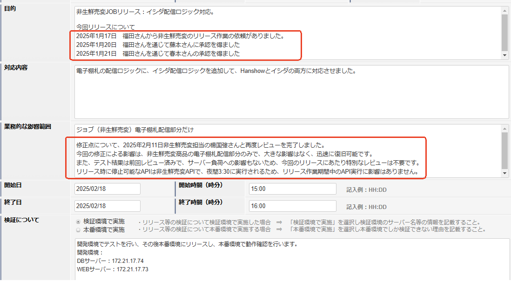

# 06.リリース

\

**一、リリース事前準備**

　1、リリーススケジュールは日本側に確認する。\
　2、システム_リリース/サーバー作業申請書を提出する前に、提出分類等を事前に明確する。\
　3、システム_リリース/サーバー作業申請書提出後、毎日具体的な承認状況を確認する。\
　4、承認を得てから、本番作業を行うことを確保する。

\

**二、リリース手順書作成必要**

**三、リリース作業前チェック項目**

<table class="wrapped">
<thead>
<tr>
<th style="text-align: left;">
No.
</th>
<th style="text-align: left;">
チェック項目
</th>
<th> 
</th>
</tr>
</thead>
<tbody>
<tr>
<td style="text-align: left;">1</td>
<td style="text-align: left;">リリース作業申請提出したか</td>
<td> 
</td>
</tr>
<tr>
<td style="text-align: left;">2</td>
<td style="text-align: left;">リリース作業申請承認したか</td>
<td> 
</td>
</tr>
<tr>
<td style="text-align: left;">3</td>
<td style="text-align: left;">リリース手順書作成したか</td>
<td> 
</td>
</tr>
<tr>
<td style="text-align: left;">4</td>
<td style="text-align: left;">リリース作業前に日本側責任者に認識一致したか</td>
<td> 
</td>
</tr>
<tr>
<td style="text-align: left;">5</td>
<td style="text-align: left;">QA審査合格したか</td>
<td> 
</td>
</tr>
</tbody>
</table>

\

**リリース申請要求：\
【周知事項】システムリリース申請について\
システムのリリース申請書には、以下の内容を必ず記載してください。\
**

- **運用組織内で確認を取った担当者の情報**
- いつ、誰が、誰の許可を得たのかを具体的に記載してください。
- **記載が不十分な場合の対応**
- 必要事項が記載されていない申請書は、末松さんのチェック時点で却下となります。

例：

レビューの実施内容の有無、もしくは不要な理由の明記してください。\
今回のリリースで停止可能なAPIの存在があるのか？停止しないなら停止しない理由の明記をお願いします。\

\

**リリース手順書**

\

**履歴**

<table class="wrapped">
<tbody>
<tr>
<th>No.</th>
<th><strong>作成日</strong></th>
<th><strong>作成者</strong></th>
<th><strong>修改者</strong></th>
<th><strong>修改日</strong></th>
<th>修改内容描述</th>
</tr>
<tr>
<td>1</td>
<td> 
</td>
<td> 
</td>
<td> 
</td>
<td> 
</td>
<td> 
</td>
</tr>
</tbody>
</table>
