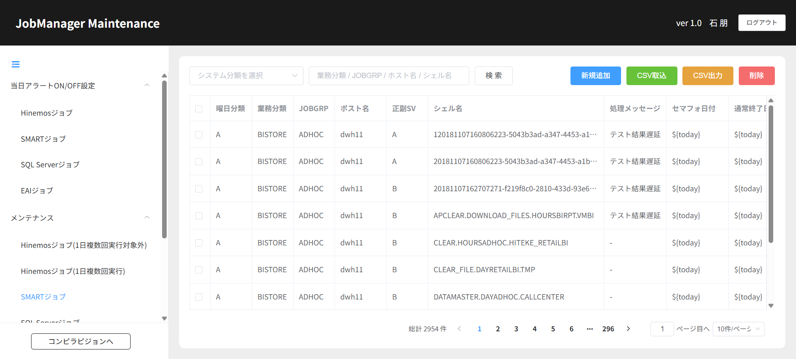

# 504130153_04_01.画面詳細設計書【SMARTジョブ】

**1.画面レイアウト**

**2．画面項目定義**

<table class="fixed-table wrapped">
<tbody>
<tr>
<td colspan="18" style="text-align: left;">■画面項目定義</td>
</tr>
<tr>
<td colspan="18" style="text-align: left;">注意：画面の項目により必要な項目を入力する</td>
</tr>
<tr>
<td style="text-align: left;">
曜日分類
</td>
<td style="text-align: left;">
システム分類
</td>
<td style="text-align: left;">
JOBGRP
</td>
<td style="text-align: left;">
ポスト名
</td>
<td style="text-align: left;">
正副SV
</td>
<td style="text-align: center;">
シェル名
</td>
<td style="text-align: center;">
処理メッセージ
</td>
<td style="text-align: center;">
セマフォ日付
</td>
<td style="text-align: center;">
通常終了日
</td>
<td style="text-align: center;">
通常終了時分
</td>
<td style="text-align: center;">
最遅終了日
</td>
<td style="text-align: center;">
最遅終了時分
</td>
<td style="text-align: center;">
有効FLG
</td>
<td style="text-align: center;">
重要度FLG
</td>
<td style="text-align: center;">
対応手順
</td>
<td style="text-align: center;">
コールフロー
</td>
<td style="text-align: center;">
ガイダンス
</td>
<td style="text-align: center;">操作</td>
</tr>
<tr>
<td style="text-align: left;"> 
</td>
<td style="text-align: left;"> 
</td>
<td style="text-align: left;"> 
</td>
<td style="text-align: left;"> 
</td>
<td style="text-align: left;"> 
</td>
<td style="text-align: left;"> 
</td>
<td style="text-align: left;"> 
</td>
<td style="text-align: left;"> 
</td>
<td style="text-align: left;"> 
</td>
<td style="text-align: left;"> 
</td>
<td style="text-align: left;"> 
</td>
<td style="text-align: left;"> 
</td>
<td style="text-align: left;"> 
</td>
<td style="text-align: left;"> 
</td>
<td style="text-align: left;"> 
</td>
<td style="text-align: left;"> 
</td>
<td style="text-align: left;"> 
</td>
<td style="text-align: left;"> 
</td>
</tr>
<tr>
<td style="text-align: left;"> 
</td>
<td style="text-align: left;"> 
</td>
<td style="text-align: left;"> 
</td>
<td style="text-align: left;"> 
</td>
<td style="text-align: left;"> 
</td>
<td style="text-align: left;"> 
</td>
<td style="text-align: left;"> 
</td>
<td style="text-align: left;"> 
</td>
<td style="text-align: left;"> 
</td>
<td style="text-align: left;"> 
</td>
<td style="text-align: left;"> 
</td>
<td style="text-align: left;"> 
</td>
<td style="text-align: left;"> 
</td>
<td style="text-align: left;"> 
</td>
<td style="text-align: left;"> 
</td>
<td style="text-align: left;"> 
</td>
<td style="text-align: left;"> 
</td>
<td style="text-align: left;"> 
</td>
</tr>
<tr>
<td style="text-align: left;"> 
</td>
<td style="text-align: left;"> 
</td>
<td style="text-align: left;"> 
</td>
<td style="text-align: left;"> 
</td>
<td style="text-align: left;"> 
</td>
<td style="text-align: left;"> 
</td>
<td style="text-align: left;"> 
</td>
<td style="text-align: left;"> 
</td>
<td style="text-align: left;"> 
</td>
<td style="text-align: left;"> 
</td>
<td style="text-align: left;"> 
</td>
<td style="text-align: left;"> 
</td>
<td style="text-align: left;"> 
</td>
<td style="text-align: left;"> 
</td>
<td style="text-align: left;"> 
</td>
<td style="text-align: left;"> 
</td>
<td style="text-align: left;"> 
</td>
<td style="text-align: left;"> 
</td>
</tr>
</tbody>
</table>

**3.イベト定義＆API一覧＆DB関連処理样例**

<table class="relative-table wrapped" style="width: 69.4263%;">
<colgroup>
<col style="width: 3%" />
<col style="width: 7%" />
<col style="width: 13%" />
<col style="width: 41%" />
<col style="width: 13%" />
<col style="width: 9%" />
<col style="width: 10%" />
</colgroup>
<tbody>
<tr>
<td style="text-align: left;"> 
</td>
<td style="text-align: left;">EVT001</td>
<td style="text-align: left;">初期処理</td>
<td style="text-align: left;">SMARTジョブ取得</td>
<td style="text-align: left;"> 
</td>
<td style="text-align: left;"> 
</td>
<td style="text-align: left;"> 
</td>
</tr>
<tr>
<td style="text-align: left;"> 
</td>
<td style="text-align: left;">EVT002</td>
<td style="text-align: left;">検索</td>
<td style="text-align: left;">選択した条件によって検索結果を出る</td>
<td style="text-align: left;"> 
</td>
<td style="text-align: left;"> 
</td>
<td style="text-align: left;"> 
</td>
</tr>
<tr>
<td style="text-align: left;"> 
</td>
<td style="text-align: left;">EVT003</td>
<td style="text-align: left;">編集</td>
<td style="text-align: left;">
画面の改修
</td>
<td style="text-align: left;"> 
</td>
<td style="text-align: left;"> 
</td>
<td style="text-align: left;"> 
</td>
</tr>
<tr>
<td style="text-align: left;"> 
</td>
<td style="text-align: left;">EVT004</td>
<td style="text-align: left;">削除</td>
<td style="text-align: left;">
画面の上に選択したデータを画面から削除する。

DB側も削除する
</td>
<td style="text-align: left;"> 
</td>
<td style="text-align: left;"> 
</td>
<td style="text-align: left;"> 
</td>
</tr>
<tr>
<td style="text-align: left;"> 
</td>
<td style="text-align: left;">EVT005</td>
<td style="text-align: left;">CSV取込</td>
<td style="text-align: left;">
データ一括インポート
</td>
<td style="text-align: left;"> 
</td>
<td style="text-align: left;"> 
</td>
<td style="text-align: left;"> 
</td>
</tr>
<tr>
<td style="text-align: left;"> 
</td>
<td style="text-align: left;">EVT006</td>
<td style="text-align: left;">CSV出力</td>
<td style="text-align: left;">
画面の上に選択したデータを画面から削除する。

DB側も削除する
</td>
<td style="text-align: left;"> 
</td>
<td style="text-align: left;"> 
</td>
<td style="text-align: left;"> 
</td>
</tr>
<tr>
<td style="text-align: left;"> 
</td>
<td style="text-align: left;">EVT007</td>
<td style="text-align: left;">ポップアップ</td>
<td style="text-align: left;">
業務分類取得 
ポスト名取得 
コールフロー取得 
ガイダンス取得 

</td>
<td style="text-align: left;"> 
</td>
<td style="text-align: left;"> 
</td>
<td style="text-align: left;"> 
</td>
</tr>
</tbody>
</table>
