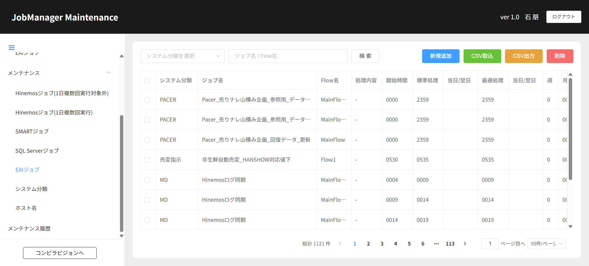

# 504130153_04_05.画面詳細設計書【EAIジョブ】

**1.画面レイアウト**

**2．画面項目定義**

<table class="fixed-table wrapped">
<tbody>
<tr>
<td colspan="17" style="text-align: left;">■画面項目定義</td>
</tr>
<tr>
<td colspan="17" style="text-align: left;">注意：画面の項目により必要な項目を入力する</td>
</tr>
<tr>
<td style="text-align: left;">
システム分類
</td>
<td style="text-align: left;">
ジョブ名
</td>
<td style="text-align: left;">
Flow名
</td>
<td style="text-align: left;">
処理内容
</td>
<td style="text-align: left;">開始時間</td>
<td style="text-align: left;">
標準処理
</td>
<td style="text-align: left;">
当日/翌日
</td>
<td style="text-align: left;">
最遅処理
</td>
<td style="text-align: center;">
当日/翌日
</td>
<td style="text-align: center;">
週
</td>
<td style="text-align: center;">
月
</td>
<td style="text-align: center;">
有効FLG
</td>
<td style="text-align: center;">
重要度FLG
</td>
<td style="text-align: center;">
対応手順
</td>
<td style="text-align: center;">
コールフロー
</td>
<td style="text-align: center;">
ガイダンス
</td>
<td style="text-align: center;">操作</td>
</tr>
<tr>
<td style="text-align: left;"> 
</td>
<td style="text-align: left;"> 
</td>
<td style="text-align: left;"> 
</td>
<td style="text-align: left;"> 
</td>
<td style="text-align: left;"> 
</td>
<td style="text-align: left;"> 
</td>
<td style="text-align: left;"> 
</td>
<td style="text-align: left;"> 
</td>
<td style="text-align: left;"> 
</td>
<td style="text-align: left;"> 
</td>
<td style="text-align: left;"> 
</td>
<td style="text-align: left;"> 
</td>
<td style="text-align: left;"> 
</td>
<td style="text-align: left;"> 
</td>
<td style="text-align: left;"> 
</td>
<td style="text-align: left;"> 
</td>
<td style="text-align: left;"> 
</td>
</tr>
<tr>
<td style="text-align: left;"> 
</td>
<td style="text-align: left;"> 
</td>
<td style="text-align: left;"> 
</td>
<td style="text-align: left;"> 
</td>
<td style="text-align: left;"> 
</td>
<td style="text-align: left;"> 
</td>
<td style="text-align: left;"> 
</td>
<td style="text-align: left;"> 
</td>
<td style="text-align: left;"> 
</td>
<td style="text-align: left;"> 
</td>
<td style="text-align: left;"> 
</td>
<td style="text-align: left;"> 
</td>
<td style="text-align: left;"> 
</td>
<td style="text-align: left;"> 
</td>
<td style="text-align: left;"> 
</td>
<td style="text-align: left;"> 
</td>
<td style="text-align: left;"> 
</td>
</tr>
<tr>
<td style="text-align: left;"> 
</td>
<td style="text-align: left;"> 
</td>
<td style="text-align: left;"> 
</td>
<td style="text-align: left;"> 
</td>
<td style="text-align: left;"> 
</td>
<td style="text-align: left;"> 
</td>
<td style="text-align: left;"> 
</td>
<td style="text-align: left;"> 
</td>
<td style="text-align: left;"> 
</td>
<td style="text-align: left;"> 
</td>
<td style="text-align: left;"> 
</td>
<td style="text-align: left;"> 
</td>
<td style="text-align: left;"> 
</td>
<td style="text-align: left;"> 
</td>
<td style="text-align: left;"> 
</td>
<td style="text-align: left;"> 
</td>
<td style="text-align: left;"> 
</td>
</tr>
</tbody>
</table>

**3.イベト定義＆API一覧＆DB関連処理样例**

<table class="relative-table wrapped" style="width: 62.0822%;">
<colgroup>
<col style="width: 4%" />
<col style="width: 6%" />
<col style="width: 8%" />
<col style="width: 29%" />
<col style="width: 15%" />
<col style="width: 10%" />
<col style="width: 24%" />
</colgroup>
<tbody>
<tr>
<td style="text-align: left;"> 
</td>
<td style="text-align: left;">EVT001</td>
<td style="text-align: left;">初期処理</td>
<td style="text-align: left;">EAIジョブ取得</td>
<td style="text-align: left;"> 
</td>
<td style="text-align: left;"> 
</td>
<td style="text-align: left;"> 
</td>
</tr>
<tr>
<td style="text-align: left;"> 
</td>
<td style="text-align: left;">EVT002</td>
<td style="text-align: left;">検索</td>
<td style="text-align: left;">選択した条件によって検索結果を出る</td>
<td style="text-align: left;"> 
</td>
<td style="text-align: left;"> 
</td>
<td style="text-align: left;"> 
</td>
</tr>
<tr>
<td style="text-align: left;"> 
</td>
<td style="text-align: left;">EVT003</td>
<td style="text-align: left;">編集</td>
<td style="text-align: left;">
画面の改修
</td>
<td style="text-align: left;"> 
</td>
<td style="text-align: left;"> 
</td>
<td style="text-align: left;"> 
</td>
</tr>
<tr>
<td style="text-align: left;"> 
</td>
<td style="text-align: left;">EVT004</td>
<td style="text-align: left;">削除</td>
<td style="text-align: left;">
画面の上に選択したデータを画面から削除する。

DB側も削除する
</td>
<td style="text-align: left;"> 
</td>
<td style="text-align: left;"> 
</td>
<td style="text-align: left;"> 
</td>
</tr>
<tr>
<td style="text-align: left;"> 
</td>
<td style="text-align: left;">EVT005</td>
<td style="text-align: left;">CSV取込</td>
<td style="text-align: left;">
データ一括インポート
</td>
<td style="text-align: left;"> 
</td>
<td style="text-align: left;"> 
</td>
<td style="text-align: left;"> 
</td>
</tr>
<tr>
<td style="text-align: left;"> 
</td>
<td style="text-align: left;">EVT006</td>
<td style="text-align: left;">CSV出力</td>
<td style="text-align: left;">
選択した条件に基づいて検索結果をエクスポートする
</td>
<td style="text-align: left;"> 
</td>
<td style="text-align: left;"> 
</td>
<td style="text-align: left;"> 
</td>
</tr>
<tr>
<td style="text-align: left;"> 
</td>
<td style="text-align: left;">EVT007</td>
<td style="text-align: left;">ポップアップ</td>
<td style="text-align: left;">
業務分類取得

コールフロー取得

ガイダンス取得
</td>
<td style="text-align: left;"> 
</td>
<td style="text-align: left;"> 
</td>
<td style="text-align: left;"> 
</td>
</tr>
</tbody>
</table>
