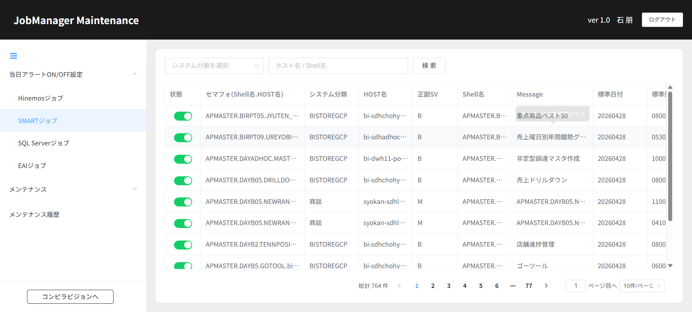

# 504130153_04_06.画面詳細設計書【SMARTジョブ】

**1.画面レイアウト**

**2．画面項目定義**

<table class="fixed-table wrapped">
<tbody>
<tr>
<td colspan="14" style="text-align: left;">■画面項目定義</td>
</tr>
<tr>
<td colspan="14" style="text-align: left;">注意：画面の項目により必要な項目を入力する</td>
</tr>
<tr>
<td style="text-align: left;">
セマフォ(Shell名.HOST名)
</td>
<td style="text-align: left;">
システム分類
</td>
<td style="text-align: left;">
HOST名
</td>
<td style="text-align: left;">
正副SV
</td>
<td style="text-align: left;">
Shell名
</td>
<td style="text-align: left;">
Message
</td>
<td style="text-align: left;">
標準日付
</td>
<td style="text-align: left;">
標準処理
</td>
<td style="text-align: left;">
最遅日付
</td>
<td style="text-align: left;">
最遅処理
</td>
<td style="text-align: left;">
曜日
</td>
<td style="text-align: center;">
有効FLG
</td>
<td style="text-align: center;">
重要度Flag
</td>
<td style="text-align: center;">
状態
</td>
</tr>
<tr>
<td style="text-align: left;"> 
</td>
<td style="text-align: left;"> 
</td>
<td style="text-align: left;"> 
</td>
<td style="text-align: left;"> 
</td>
<td style="text-align: left;"> 
</td>
<td style="text-align: left;"> 
</td>
<td style="text-align: left;"> 
</td>
<td style="text-align: left;"> 
</td>
<td style="text-align: left;"> 
</td>
<td style="text-align: left;"> 
</td>
<td style="text-align: left;"> 
</td>
<td style="text-align: left;"> 
</td>
<td style="text-align: left;"> 
</td>
<td style="text-align: left;"> 
</td>
</tr>
<tr>
<td style="text-align: left;"> 
</td>
<td style="text-align: left;"> 
</td>
<td style="text-align: left;"> 
</td>
<td style="text-align: left;"> 
</td>
<td style="text-align: left;"> 
</td>
<td style="text-align: left;"> 
</td>
<td style="text-align: left;"> 
</td>
<td style="text-align: left;"> 
</td>
<td style="text-align: left;"> 
</td>
<td style="text-align: left;"> 
</td>
<td style="text-align: left;"> 
</td>
<td style="text-align: left;"> 
</td>
<td style="text-align: left;"> 
</td>
<td style="text-align: left;"> 
</td>
</tr>
<tr>
<td style="text-align: left;"> 
</td>
<td style="text-align: left;"> 
</td>
<td style="text-align: left;"> 
</td>
<td style="text-align: left;"> 
</td>
<td style="text-align: left;"> 
</td>
<td style="text-align: left;"> 
</td>
<td style="text-align: left;"> 
</td>
<td style="text-align: left;"> 
</td>
<td style="text-align: left;"> 
</td>
<td style="text-align: left;"> 
</td>
<td style="text-align: left;"> 
</td>
<td style="text-align: left;"> 
</td>
<td style="text-align: left;"> 
</td>
<td style="text-align: left;"> 
</td>
</tr>
</tbody>
</table>

**3.イベト定義＆API一覧＆DB関連処理样例**

<table class="relative-table wrapped" style="width: 62.0274%;">
<colgroup>
<col style="width: 4%" />
<col style="width: 6%" />
<col style="width: 8%" />
<col style="width: 29%" />
<col style="width: 15%" />
<col style="width: 10%" />
<col style="width: 24%" />
</colgroup>
<tbody>
<tr>
<td style="text-align: left;"> 
</td>
<td style="text-align: left;">EVT001</td>
<td style="text-align: left;">初期処理</td>
<td style="text-align: left;">Hinemosジョブ(1日複数回実行対象外)取得</td>
<td style="text-align: left;"> 
</td>
<td style="text-align: left;"> 
</td>
<td style="text-align: left;"> 
</td>
</tr>
<tr>
<td style="text-align: left;"> 
</td>
<td style="text-align: left;">EVT002</td>
<td style="text-align: left;">検索</td>
<td style="text-align: left;">選択した条件によって検索結果を出る</td>
<td style="text-align: left;"> 
</td>
<td style="text-align: left;"> 
</td>
<td style="text-align: left;"> 
</td>
</tr>
<tr>
<td style="text-align: left;"> 
</td>
<td style="text-align: left;">EVT003</td>
<td style="text-align: left;">状態</td>
<td style="text-align: left;">
状態の改変
</td>
<td style="text-align: left;"> 
</td>
<td style="text-align: left;"> 
</td>
<td style="text-align: left;"> 
</td>
</tr>
</tbody>
</table>
