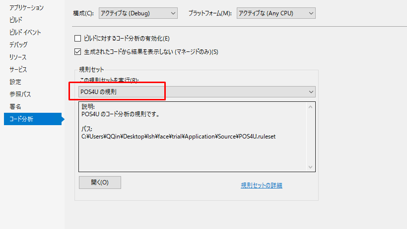

### 1. 新建Project
右击“UI”，选择“Add——New Project”选项。

   

1）在弹出的“Add New Project”选项卡，选择“Visual C#”   
2）继续选择“Class Library(.NET Framework)”），   
3）创建UI项目，Name要以“WinPOS.UI.”为前缀，以“View”为后缀。    
4）Location必须选择“项目所在位置/WinPOS/UI/”文件夹。  

    

### 2.选择Framework。
右击“新建的Project”，选择“Properties”。
    
选择“.NET Framework 4”    
  
### 3.增加署名
从其他的Project，拷贝“AssemblyKey.snk”文件，粘贴到“新建的Project”    
   
右击“新建的Project”，选择“Properties”。    
   
选择“Signing”选项，并且选中“Sign the assembly”选项     
   
选择“Choose a strong name key file”下拉列表，选择“AssemblyKey.snk”选项并保存。  
 
POS4U自定义规则应用  
