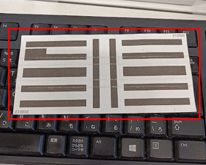

| 日本语 | カタカナ/英语 | 中文 |		
| :-----| ----: | :----: |		
| 現金 | げんきん | 现金 | 				
| 支払手段 | しはらいしゅだん | 支付方式 | 				 		
| 異常 | いじょう | 异常 | 		 		 		
| 係員 | かかりいん | 工作人员 | 				
| プリペイドカード | prepaidCard | 预付卡 | 						
| 金券入力 | きんけんにゅうりょく | 金券入力 （使用各种商品券支付）| 		
| 釣銭機 | つりせんき | （自助收银机可以吃钱可以找零） | 		
| 残高 | ざんだか | 余额 | 		
| 営業 | えいぎょう | 营业 | 		
| 売上 | うりあげ | 销售额 | 		
| ジャーナル | journal | 购买日志 | 		
| レシート | receipt | 小票，收据 | 						
| お買物中止 | おかいもの ちゅうし | 停止购物 | 		| 		
| 会員 | かいいん | 会员 | 				
| 商品 | しょうひん | 商品 | 		
| 会計 | かいけい | 结账，付款 | 				
| 値引 | ねびき | 降价（按数值降价） | 		
| 割引 | わりびき | 打折（按百分比降价） | 		
| 両替機 | りょうがえき | 零钱兑换机 | 		
| デビットカード | debit card | 借记卡 | 		
| レポート | report | 报告 |
| 点滅 | てんめつ | 灯忽亮忽灭（） | 			
| 点灯 | てんとう | 灯亮（） | 			
| 消灯 | しょうとう | 熄灯 （）| 			
| 紙幣 | しへい | 纸币 | 			
| 硬貨 | こうか | 硬币 | 			
| 会計機 | かいけいき | 结账机器（顾客使用，用来结账） | 			
| 登録機 | とうろくき | 商品登陆机器（工作人员使用，用来扫描商品） |
| 防犯 | ぼうはん | 贵重商品贴的防盗条形码 | 			
| レジ袋 | レジぶくろ | 购物袋 | 						
| 税込み | ぜいこみ | 含税，未扣除税款 | 			
| 税抜き | ぜいぬき | 不含税，除税 |
| 会员番号 | かいいんばんごう |   			
| 自動値下げ | じどうねさげ | 自动降价 | 	
| 補充金    | ほじゅきん | （釣銭機资金不足时需要补充的金额） | 	
| 回収金額    |  | （釣銭機资金过满时需要回收的金额） | 	 	
| 在高    |  | 釣銭機现有资金 | 	
| 回収庫   |  |  | 	
| 回収額更新    |  |  | 	
| 取引ログタイプ |  | 取引ログ种别定义 | 
| ドロア |  |抽屉(放钱的盒子)|   
| 照会 | しょうかい | 照会，询问。咨询处。 | 
| 擬似紙幣| ぎじしへい | 仿真纸币 [擬似紙幣](#img_1)|  

- <A name="img_1">仿真纸币</A>   
 

 
  