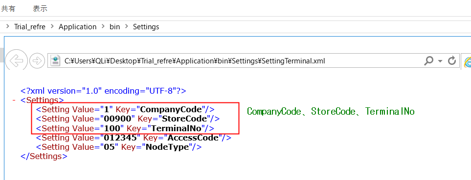
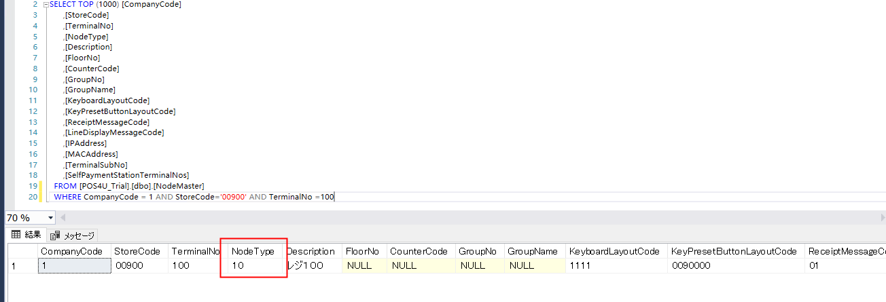

|ID|NodeType|名称|
|:---|:---|:---|
|1 |00|全端末|
|2 |01|GOカート|
|3 |02|GOセルフ|
|4 |03|オーダーキッチン(古)|
|5 |04|GO対面レジ|
|6 |05|現金会計機|
|7 |06|携帯APP|
|8 |07|GOセミセルフ登録機|
|9 |08|GOセミセルフ会計機|
|10|09|GOフルセルフ(ロカール版)|
|11|10|GO対面レジ(サービス)|
|12|11|医薬品レジ|
|13|12|オーダーキッチン|
|14|13|レーンレジ|
|15|50|チャージ機|

###### 注：
**`NodeType`**为DB中设置的值
VMの設定方式：
<1>事前確認ー端末番号

<２>NodeType設定
[POS4U_Trial].[dbo].[NodeMaster]テーブルに、NodeType変更

