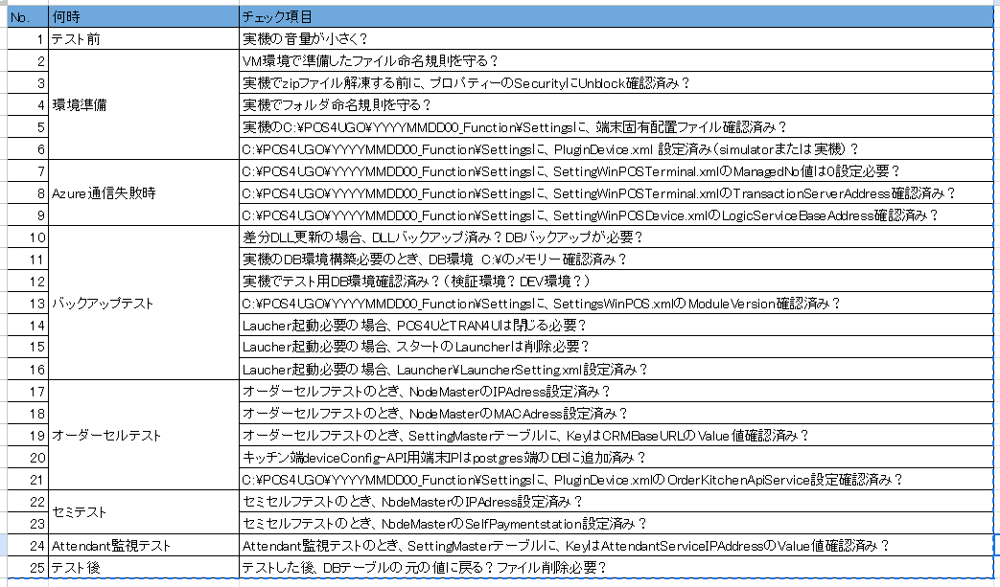

<table border="1" cellspacing="0" cellpadding="4">
  <thead style="background-color: #d4edda;">
    <tr>
      <th>No.</th>
      <th style="width: auto;">何時</th>
      <th>チェック項目</th>
    </tr>
  </thead>
  <tbody>
    <tr>
      <td>1</td>
      <td>テスト前</td>
      <td>実機の音量が小さく？</td>
    </tr>
<!--環境準備-->
    <tr>
      <td>2</td>
      <td rowspan="5">環境準備</td>
      <td>VM環境で準備したファイル命名規則を守る？</td>
    </tr>
    <tr>
      <td>3</td>
      <td>実機でzipファイル解凍する前に、プロパティーのSecurityにUnblock確認済み？</td>
    </tr>
    <tr>
      <td>4</td>
      <td>実機でフォルダ命名規則を守る？</td>
    </tr>
    <tr>
      <td>5</td>
      <td>実機のC:\POS4UGO\YYYYMMDD00_Function\Settingsに、端末固有配置ファイル確認済み？</td>
    </tr>
    <tr>
      <td>6</td>
      <td>C:\POS4UGO\YYYYMMDD00_Function\Settingsに、PluginDevice.xml 設定済み（simulatorまたは実機）？</td>
    </tr>
<!--Azure通信失敗時-->
  <tr>
      <td>7</td>
      <td rowspan="3" style="width: auto;">Azure通信失敗時</td>
      <td>C:\POS4UGO\YYYYMMDD00_Function\Settingsに、 SettingWinPOSTerminal.xmlのManagedNo値は0設定必要？</td>
    </tr>
    <tr>
      <td>8</td>
      <td>C:\POS4UGO\YYYYMMDD00_Function\Settingsに、 SettingWinPOSTerminal.xmlのTransactionServerAddress確認済み？</td>
    </tr>
    <tr>
      <td>9</td>
      <td>C:\POS4UGO\YYYYMMDD00_Function\Settingsに、 SettingWinPOSDevice.xmlのLogicServiceBaseAddress確認済み？</td>
    </tr>
<!--バックアップテスト-->
  <tr>
      <td>10</td>
      <td rowspan="7" style="width: auto;">バックアップテスト</td>
      <td>差分DLL更新の場合、DLLバックアップ済み？DBバックアップが必要？</td>
    </tr>
    <tr>
      <td>11</td>
      <td>実機のDB環境構築必要のとき、DB環境　C:\のメモリー確認済み？</td>
    </tr>
    <tr>
      <td>12</td>
      <td>実機でテスト用DB環境確認済み？（検証環境？DEV環境？）</td>
    </tr>
    <tr>
      <td>13</td>
      <td>C:\POS4UGO\YYYYMMDD00_Function\Settingsに、 SettingsWinPOS.xmlのModuleVersion確認済み？</td>
    </tr>
    <tr>
      <td>14</td>
      <td>Laucher起動必要の場合、POS4UとTRAN4Uは閉じる必要？</td>
    </tr>
    <tr>
      <td>15</td>
      <td>Laucher起動必要の場合、スタートのLauncherは削除必要？</td>
    </tr>
    <tr>
      <td>16</td>
      <td>Laucher起動必要の場合、Launcher\LauncherSetting.xml設定済み？</td>
    </tr>
<!--オーダーセルテスト-->
  <tr>
      <td>17</td>
      <td rowspan="5" style="width: auto;">オーダーセルテスト</td>
      <td>オーダーセルフテストのとき、NodeMasterのIPAdress設定済み？</td>
    </tr>
    <tr>
      <td>18</td>
      <td>オーダーセルフテストのとき、NodeMasterのMACAdress設定済み？</td>
    </tr>
    <tr>
      <td>19</td>
      <td>オーダーセルフテストのとき、SettingMasterテーブルに、 KeyはCRMBaseURLのValue値確認済み？</td>
    </tr>
    <tr>
      <td>20</td>
      <td>キッチン端deviceConfig-API用端末IPはpostgres端のDBに追加済み？</td>
    </tr>
    <tr>
      <td>21</td>
      <td>C:\POS4UGO\YYYYMMDD00_Function\Settingsに、 PluginDevice.xmlのOrderKitchenApiService設定確認済み？ </td>
    </tr>
<!--セミテスト-->
  <tr>
      <td>22</td>
      <td rowspan="2" style="width: auto;">セミテスト</td>
      <td>セミセルフテストのとき、NodeMasterのIPAdress設定済み？</td>
    </tr>
    <tr>
      <td>23</td>
      <td>セミセルフテストのとき、NodeMasterのSelfPaymentstation設定済み？</td>
    </tr>
<!--セミテスト-->
    <tr>
      <td>24</td>
      <td style="width: auto;">Attendant監視テスト</td>
      <td>Attendant監視テストのとき、SettingMasterテーブルに、 KeyはAttendantServiceIPAddressのValue値確認済み？</td>
    </tr>
<!--セミテスト-->
    <tr>
      <td>25</td>
      <td style="width: auto;">テスト後</td>
      <td>テストした後、DBテーブルの元の値に戻る？ファイル削除必要？</td>
    </tr>
  </tbody>
</table>

