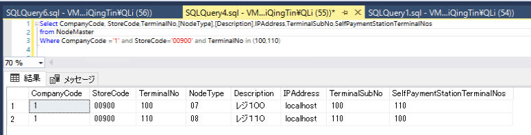
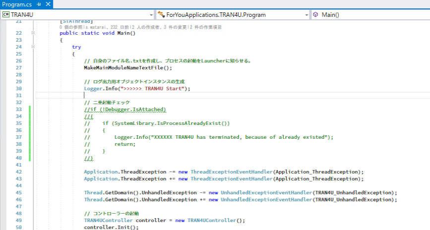
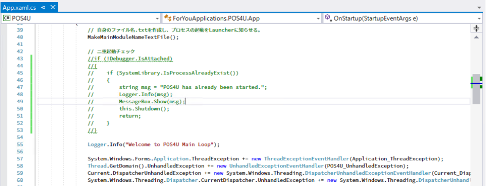
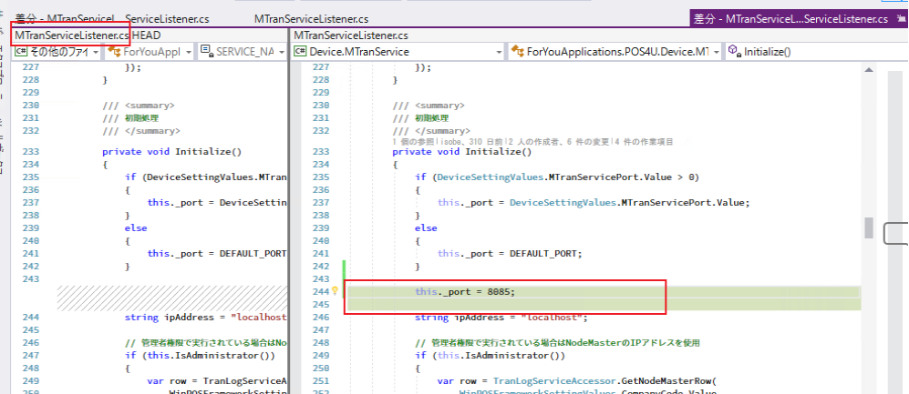
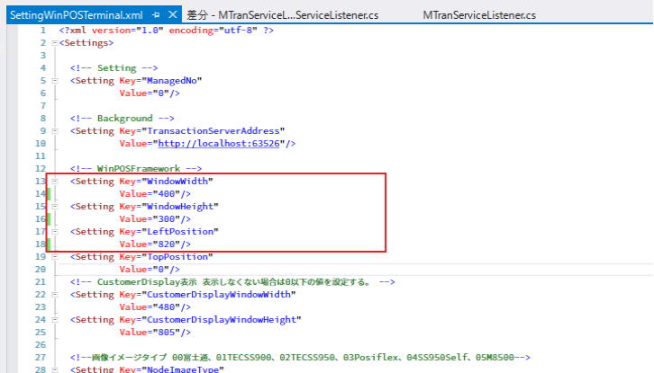
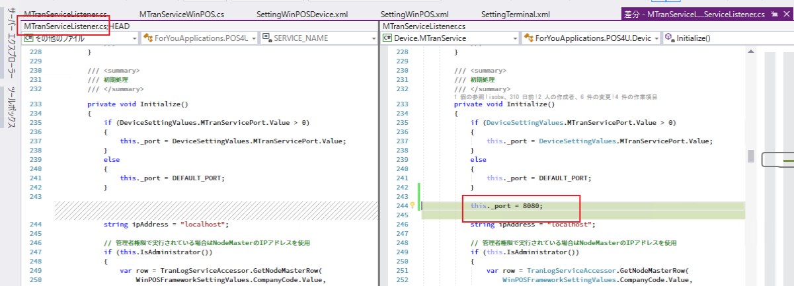
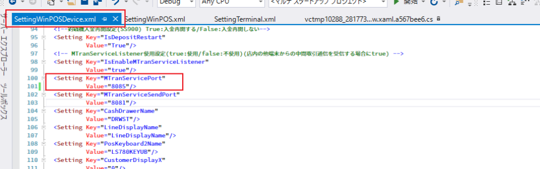
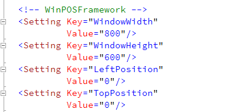

#### 如果因为开发测试需求，需要在开发环境搭建登录机会计机，需要修改部分source：
   >登录机会计机必须有不同端口号，
   >
   >去掉POS4U的“二重登录防止”限定
   >

#### 例：搭建如下环境#
  | 会计机 110 |
  | 登陆机 100 |

#### 手顺：

###### 1、克隆两份代码  1份作为登录机source；1份作为会计机source

###### 2、NodeMaster中追加端末信息如下：
   

###### 3、搭建会计机环境：

+ 修改代码：
> TRAN4U\Program.cs 二重启动部分注释掉

> POS4U\App.xaml.cs 二重启动部分注释掉

> MTranServiceListener.cs修改受信端口号为8085（8081，8080以外的端口号即可）

+ 修改配置：
> SettingTerminal.xml  修改端末号为110
> 
> SettingWinPOSTerminal.xml  修改分辨率 和 位置

+ 修改启动项：			
> POS4ULogicService  启动
>
> POS4U		启动
>
> TRAN4U		启动	
>

###### 4、搭建登录机环境：

+ 修改代码：
> TRAN4U\Program.cs 二重启动部分注释掉

> POS4U\App.xaml.cs 二重启动部分注释掉

> MTranServiceListener.cs修改受信端口号为8080

+ 修改配置：
> SettingTerminal.xml  修改端末号为100
>SettingWinPOSTerminal.xml  修改分辨率 和 位置 
> SettingWinPOSDevice.xml  修改送信端口号 8085

> SettingWinPOSTerminal.xml  修改分辨率 和 位置
>
> 

+ 修改启动项：	
> POS4ULogicService  不启动
>
> POS4U		启动
>
> TRAN4U		不启动	
>

###### 5.启动两份source