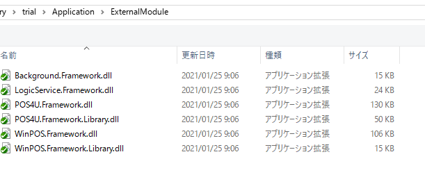
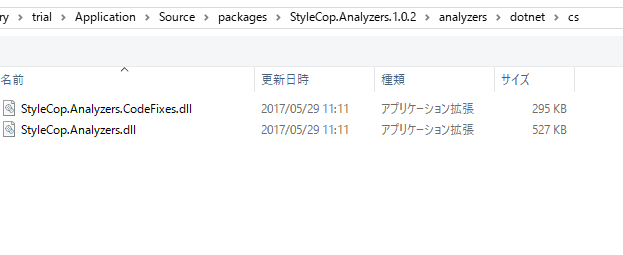

## 开发注意事项一览
|ID|区分|注意点|説明|備考|
|:---|:---|:---|:---|:---|
|1|ソース|*.FirstOrDefault().Value|NULLチェック必要|避免空指针异常|
|2|新規|新規支払方法する時、AzureとBackground集計を忘れないように|現金管理と基幹の連携テスト必要||
|3|新規|新規トランタイプする時_売上と返品とチャージ以外_Azureの基幹送信要確認|例_チャージ取消||
|4|改修|改修漏れ防止のため、改修元を全検索してください||
|5|新規|Image追加時、ソースに既存の項目を追加します。||
|6|新規|XML追加時、属性を変更してください。|resource→コンテンツ、コーヒーない→常にコピーする/新しい場合はコーヒーする	
|7|新規|追加状態にスキャナー利用不可の場合、ObserverのDictionaryに追加必要です||
|8|新規|新規NodeTypeするとき、AzureとBackground企画情報を忘れないように||
|9|新規|新規プロジェクトするとき、POS4U参照にDllを追加する||
|10|ソース|無用の引用（using）を削除してください。   ⇒　新規のFileが無用の引用（using）を削除してください | 新規のFileのみ |
|11|ソース|画面用string→int転換	"|e.g.:   int data = 0;  int.TryParse("123", out data); (〇) int.TryParse("123", out int data); (×)|
|13|ソース|コマンドは引継使用できます。||[図１](#img_1)|
|14|改修|改修前に影響範囲を確認して報告してください||
|15|テスト|最新モジュールテストには、DataBase再構築の前提に、TranLogデータ確認必要|特に項目追加する時|
|16|修改/新规|修改或者新创建存储过程的时候，明确创建在哪个数据库下（BO侧一般创建在POS4U_Trial_Tran数据库下）||[図2](#img_2)| 
|17|修改/新规|判断从tranDs中取得数据字段是不是null的时候，使用`*.Is*Null()`|避免空指针|[図3](#img_3)|
|18|ソース|メッセージ追加／変更する時、Message_FC.xml、MessageRJ_FC.xmlも更新必要|FC統合後|
|19|ソース|Settings更新時、レーンレジの*CH.xmlファイルの更新を忘れないように||
|20|ソース|以前実装したソースはプッシュ前に改めて確認テストが必要です||
|21|リリース|DBテーブルにデータ追加があれば、一括配信依頼必須||
|22|ソース|シミュレーターの信頼性が低いです、APIまたDeviceのレスポンスを確認する||
|23|ソース|Deviceにかかわるソースの修正は非常に危険のものです。コミット、プッシュはレビュー実施の徹底|| 
|24|新规|Device参照, 确认参照路径; 代码分析包引用参照。||[図4](#img_4)|
|25|新规|新规工程时，需要packages.config文件，依赖DLL包的管理|

### 備考
- <A name="img_1">図１</A>  
  
  
- <A name="img_2">図2 </A>  
 
- <A name="img_3">図3 </A>  

 
- <A name="img_4">図4 (1)POS4U.framework的DLL (2)代码分析参照引用</A>  

