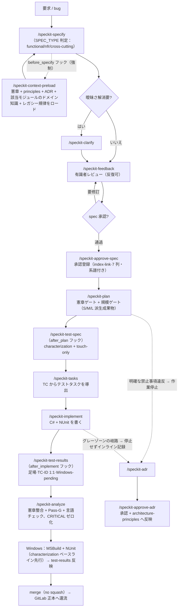

# trialpos（POS4U）SDD 開発フロー · 説明書

> **POS4U コードベース（`trialpos-snapshots`）上で SDD 開発を一巡する方法**を説明する。これは「やり方」の手順書であり、**真実源ではない**——ルールは憲章 / architecture-principles / ADR が優先（§11）。
> 関連：統治の詳細は憲章（`constitution-trialpos-{zh,ja,en}.md`、**正本は日本語 v2.0.0**）；体系の構築経緯は `trialpos-sdd-adoption-plan.md`。
> ⚠️ **P5（2026-07-18）より SDD 装置は全面日本語化**：リポジトリ内のプロセスファイルと全 SDD 成果物（spec/plan/tasks/…）は一律**日本語**（憲章「言語規約」）。本説明書は trec-docs（中国語ナレッジ庫）所属だが日本語版として維持する。

## 0. 一言で

要求 → `/speckit-*` コマンドチェーンで `spec → plan → tasks → コード + テスト` に変換。全工程が**憲章 / アーキテクチャ原則 / ADR / ドメイン知識で自動的に制約される**（context-preload フック）。**レガシー四鉄則**：①変更前に characterization テストで固定 ②触れた箇所のみテスト ③ビルド/テストは Windows ④**成果物は一律日本語**。

## 1. 対象と前提

- **対象**：`trialpos-snapshots` 上で POS4U コードを変更する人（AI 協働を含む）。
- **前提**：本リポジトリには SDD 導入済み（`.specify/` + `.claude/skills/` + `.claude/knowledge/`）。origin は fetch/バージョン切替専用・**push 無効化済み**（作業は `sdd/main`）。
- **プラットフォーム**：本環境（Mac/AI）は **authoring**（仕様/計画/コーディング/analyze）のみ。**ビルド＋テストは Windows + MSBuild/VS**。
- **言語**：対話は個人設定に従う（中国語可）。**書き出される SDD 成果物とコードコメントは日本語**（テンプレート/skill に強制が内蔵されており、コマンドチェーンに従えば自動的に満たされる）。

## 2. フロー全景

> `plan`/`implement`/`analyze` の前にも `before_*` フックが context-preload を自動実行する（図では specify のみ描画、煩雑さ回避）。

## 3. 各段階クイックリファレンス

| コマンド | 何をするか（POS4U 文脈） | 成果物（**日本語**） | ゲート |
|---|---|---|---|
| **`/speckit-specify <要求>`** | 要求 → 挙動にフォーカスした spec。**SPEC_TYPE 判定**（functional / nfr / cross-cutting → テンプレート選択）＋規模自己評価（S/M/L）。品質 checklist を自動生成 | `specs/<NNN>-<名>/spec.md` + `checklists/` | checklist 全緑で plan へ |
| `/speckit-clarify` | ≤5 問で曖昧さ解消（触れるモジュール/テーブル/SP、Framework.dll 境界に触れるか） | spec 増分 | スキップ可（曖昧なままは非推奨） |
| **`/speckit-plan`** | 実装計画＋**憲章チェックゲート**＋**派生成果物ゲート**（S/M/L に応じ research/data-model/contracts/quickstart を選択、派生しないものは理由明記）＋同型パターン全棚卸し＋ADR 制約反映 | `plan.md`（＋規模に応じた派生成果物） | 憲章衝突 = 停止 |
| `/speckit-test-spec`（after_plan 自動） | characterization + 回帰テストポイント表（NUnit）。**plan 段階成果物** | `test-spec.md` | レビュー後 tasks へ |
| **`/speckit-tasks`** | test-spec の **TC からテストタスクを導出**＋依存順序＋終盤の**同期ゲートタスク**（DB/SP・契約・docs） | `tasks.md` | — |
| **`/speckit-implement`** | C# + characterization/新テストを書く。逸脱検知 | コード変更＋テスト | — |
| `/speckit-test-results`（after_implement 自動） | 足場生成：TC-ID↔テストメソッド **1:1 マッピング**、結果は Windows-pending | `test-results.md` | Windows 実行後に反映、**merge 前最終コミットで確定** |
| **`/speckit-analyze`** | spec/plan/tasks ↔ 憲章整合＋**Pass-G**（test-results 欠落/失敗/未マッピング=CRITICAL）＋**言語整合性**（成果物が日本語でない=MEDIUM）（**PR 前必須**） | 整合性レポート | **CRITICAL ゼロ化** |
| `/speckit-feedback` → `/speckit-approve-spec` | 有識者レビューの反復（新しいつまずきは blind-spots へ反映）→ 承認登録（index-link） | `spec_review.md` / index | 承認前に未決ゼロ化 |
| `/speckit-adr` → `/speckit-approve-adr` | **二速 ADR**（§6 参照）→ 有識者承認後「今後への制約」を architecture-principles へ反映 | `adr/NNNN-*.md` | 承認済みのみ強制制約 |

**ステータス生命周期**（spec / test-spec 共通）：`Draft → レビュー待ち → 承認済み`。test-results：`未完了 → レビュー待ち → 承認済み`。

## 4. ナレッジ層と自動ロード（重要：ルールを手動で覚える必要はない）

`specify / plan / implement / analyze` のたびに、`.specify/extensions.yml` の **mandatory フックが `/speckit-context-preload` を自動実行**し、以下を**コンテキストへ溶接**する：

| ナレッジ | 位置 | 役割 |
|---|---|---|
| 憲章 **v2.0.0** | `.specify/memory/constitution.md` | 第一原理 F1〜F5＋8 原則＋技術制約＋**言語規約**（最高統治） |
| アーキテクチャ原則 | `.claude/knowledge/architecture-principles.md` | 禁止事項 / 必須パターン / レイヤ / データ / IPC / 横断 |
| ADR | `.claude/knowledge/adr/0001~0004` | 既存決定の硬制約（5要素複合主キー / WCF / オフライン / TLog XML） |
| ドメイン知識 | `.claude/knowledge/domain-knowledge/<モジュール>-{checklist,blind-spots}` | 当該モジュールのレビュー観点＋つまずき（sales/discount/payment/return 整備済み） |
| テスト戦略 | `.claude/knowledge/testing-strategy.md` | characterization + touch-only + NUnit |
| **レガシー規律** | `.claude/knowledge/legacy-sdd-disciplines.md` | 規模ゲート（S/M/L）/ 全鎖トレーサビリティ＋明示的スコープ外 / 同型全棚卸し / 同期ゲート / 二速 ADR / blind-spots ループ |

> 触れるモジュールに domain-knowledge が**ない**場合、context-preload が知らせる——`trialpos-trec-docs/01-trialpos-docs/30_domain/<モジュール>` から必要に応じシード可能。
> ⚠️ ナレッジ層の内容は P5 より**日本語**（正本はチーム言語に従う）。本ナレッジ庫（中国語）は引き続きその「コピー素材源」である。

## 5. レガシーシステム特別ルール（必ず覚える）

1. **挙動保全**：レガシーコードを変更する**前に characterization テストで現行挙動を固定**。変更は既定で観察可能な挙動を変えない（憲章 I）。
2. **touch-only**：触れた箇所のみテスト。**全量カバレッジを追わず、数値ゲートも設けない**（憲章 III）。
3. **プラットフォーム分離**：Mac/AI は書くだけ。**ビルド＋テストは Windows**——Windows で通るまで **merge しない**（test-results 反映＋Pass-G が担保）。
4. ⚠️ **.NET バージョン変更禁止**：端末は WinXP/7/10/11 に跨り、v4.0 が XP 互換上限（憲章 技術制約）。
5. **uncheckable**：`POS4U.Framework.dll` はソースなし——内部を憶測せず、公開フックポイント（TranBase/CommandBase/Observer/EventCode）経由でのみ拡張。
6. **連動修正の鉄則**：支払方法の新設 → Azure + Background 集計を必ず同期（gotcha#2）。TranType/NodeType 新設 → 基幹送信を確認（#3/#8）。Device 変更は commit 前に必ずレビュー（#23）。
7. **データ**：取引のクエリ/外部キーは 5 要素複合主キーを携行。SP の変更/新設は Master / Tran どちらの DB かを明示。
8. **規模ゲート（適正規模）**：S=bugfix は最小成果物セット。M（データ/インターフェースに触れる）は data-model/contracts/research/quickstart を追加。L（モジュール横断/ADR 敏感）はさらに spec_review。**派生しない成果物は理由を明示**（明示的スコープ外）。
9. **言語規約**：SDD 成果物・コードコメント＝日本語。変数/関数名＝英語。コミット＝英語 type＋日本語説明＋`[spec:NNN-名]` タグ（憲章「言語規約」）。

## 6. ADR：二速プロトコル（いつ止まり、いつ止まらないか）

- architecture-principles「禁止事項」/憲章条項への**明確な違反** → **作業停止**、`/speckit-adr` でチームと協議のうえ記録（憲章「例外は ADR」）。
- **グレーゾーンの岐路**（複数実装案/トレードオフ/既存 ADR 境界/横断影響）→ **停止しない**：インラインで判断を記録し、事後に `提案中` ADR を起草して継続。
- ADR 状態：`提案中`（参考）/ `承認済み`（**強制**。`/speckit-approve-adr` が architecture-principles へ反映）/ `却下`（必読・再提案防止）/ `非推奨`（既存許容・新規禁止）。
- 「小さな例外」の独断処理は**許されない**。「判断の記録」自体が本プロジェクトのナレッジ資産（憲章 F4）。

## 7. 人手ゲート（AI は代替不可）

AI は初稿生成と整合性検出のみ。「これで良い」の判断は常に人間：

| ゲート | 時点 | 担当 |
|---|---|---|
| 仕様承認 | specify 終盤 | 有識者 / PO |
| test-spec レビュー | plan 後 | 有識者 / QA |
| test-results レビュー | Windows 実行後 | 有識者 / QA（merge 前最終コミットで確定） |
| ADR 承認 | 随時 | 有識者 |
| analyze CRITICAL=0 | PR 前 | 実装者が実行 |

## 8. ブランチ / マージ / 還流

- SDD 作業は `sdd/main`。feature ブランチは `sdd/main` から（`specs/` は sequential 採番 `NNN-名`）。
- **merge commit（squash しない）**——spec/plan/tasks/implement のサブコミットを追跡可能なまま保持。
- **コミット規約**：Conventional Commits（type/scope 英語・説明日本語）＋ `[spec:NNN-名]`。原則 1 タスク＝1 コミット。例：`fix(discount): 小計値引の按分額を LineTotal に反映 [spec:001-fix-discount]`
- origin は fetch/バージョン切替専用・**push 無効化済み・要明示許可**。本リポジトリは GitLab 正本のクローンであり、**変更はチーム既存チャネルで正本へ還流**（本リポジトリは SDD 統治とパイロットのみ）。

## 9. 実例（dogfood #001）

`DiscountMaker` の永続化 NRE（最初の値引で必ずクラッシュ）を直す一巡は `trialpos-sdd-adoption-plan.md` **付録 B** 参照：
`/speckit-specify`（フックが discount ドメイン知識を自動ロード → BP-DISCOUNT-002 を直撃）→ plan（憲章ゲート全緑）→ tasks（characterization 前置）→ 実コードで欠陥確認 → implement（同ファイルの兄弟メソッドに揃え、取引ヘッダから `TransactionNo` を取得）→ analyze（CRITICAL=0。ゲートは Windows-pending）。ブランチ `001-fix-discount-maker-nre`。

**要点**：ドメイン知識が実バグへ直行させてくれる。正しい修正はしばしば「そのファイル自身の既存パターン」——これが「現行アーキテクチャの尊重」。（注：この dogfood 成果物は P5 以前のもので中国語。P5 以降の新規成果物は一律日本語。）

## 10. 新規参加者 Day-1 クイックスタート

1. `CLAUDE.md`（日本語）＋憲章を読む（`constitution-trialpos-*.md` の任意言語。正本＝日本語 v2.0.0）。
2. `/speckit-specify "やりたいこと（新機能または bug）"` —— フックが自動でナレッジをロードし、**日本語の** spec を生成。
3. コマンドチェーンに従う：`plan → test-spec（after_plan 自動）→ tasks → implement → test-results（after_implement 自動）`。各ステップで §5 の鉄則を守る。
4. PR 前に `/speckit-analyze` で CRITICAL をゼロ化。
5. 変更＋テストを **Windows** でビルド＋NUnit 実行（characterization ベースライン先行）し、test-results を反映。
6. merge（no squash）。変更はチームチャネルで GitLab 正本へ還流。

## 11. 権威とメンテナンス

- **真実源の優先順位**：憲章 > `architecture-principles.md` > ADR > **本書**。本書は手順書にすぎない。
- ルール変更は `trialpos-snapshots` の憲章/ナレッジ層が正。本書と食い違う場合は**コードリポジトリを正**とし、本書を手動で追随させる。
- コマンド実装は `.claude/skills/speckit-*`。ツール基盤バージョンとカスタマイズ台帳（P5 言語フォーク注記を含む）は `.specify/SPECKIT_BASELINE.md`。
