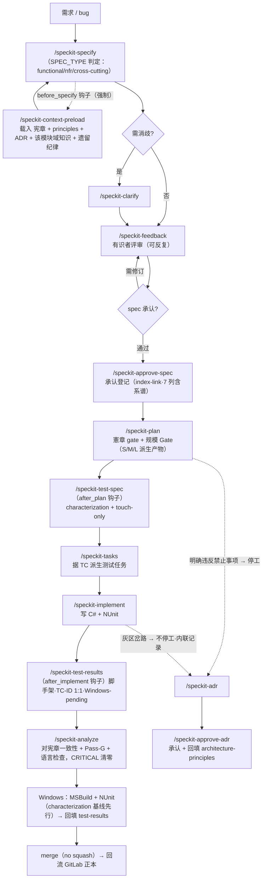

# trialpos（POS4U）SDD 开发流程 · 说明文档

> 教你**在 POS4U 代码库（`trialpos-snapshots`）上，如何用 SDD 走一次开发**。这是"怎么做"的操作说明，**不是真相源**——规则以宪章 / architecture-principles / ADR 为准（§11）。
> 配套：治理详见宪章（`constitution-trialpos-{zh,ja,en}.md`，**正本为日语 v2.0.0**）；体系怎么建成见 `trialpos-sdd-adoption-plan.md`。
> ⚠️ **P5（2026-07-18）起 SDD 装置全面日语化**：仓内流程文件与全部 SDD 产物（spec/plan/tasks/…）一律**日语**（宪章「言語規約」）；本说明文档属 trec-docs（中文知识库），保持中文。

## 0. 一句话

需求 → 用 `/speckit-*` 命令链把它变成 `spec → plan → tasks → 代码 + 测试`，全程被**宪章 / 架构原则 / ADR / 域知识自动约束**（context-preload 钩子）；**遗留系统四铁律**：①改前钉 characterization 测试 ②只测你动到的 ③构建/测试在 Windows ④**产物一律日语**。

## 1. 适用对象与前提

- **对象**：在 `trialpos-snapshots` 上改 POS4U 代码的人（含 AI 协作）。
- **前提**：本仓已装好 SDD（`.specify/` + `.claude/skills/` + `.claude/knowledge/`）；origin 仅 fetch/切版本、**push 已禁用**（工作在 `sdd/main`）。
- **平台**：本环境（Mac/AI）做 **authoring**（规格/计划/写码/analyze）；**构建 + 测试在 Windows + MSBuild/VS**。
- **语言**：对话随个人设定（中文可）；**写出的 SDD 产物与代码注释是日语**（模板/skill 已内建强制，正常跟着命令链走即自动满足）。

## 2. 流程全景

> `plan`/`implement`/`analyze` 前同样有 `before_*` 钩子自动跑 context-preload（图中只画了 specify 处，避免杂乱）。

## 3. 各阶段速查

| 命令 | 做什么（POS4U 语境） | 产物（**日语**） | 门控 |
|---|---|---|---|
| **`/speckit-specify <需求>`** | 需求 → 行为聚焦的 spec；**SPEC_TYPE 判定**（functional / nfr / cross-cutting → 选模板）+ 规模自评（S/M/L）；自建质量 checklist | `specs/<NNN>-<名>/spec.md` + `checklists/` | checklist 全绿才进 plan |
| `/speckit-clarify` | ≤5 问消歧（触及哪些模块/表/SP、是否碰 Framework.dll 边界） | spec 增量 | 可跳过（不建议模糊时跳） |
| **`/speckit-plan`** | 实装计划 + **憲章 Check gate** + **派生产物 Gate**（按 S/M/L 勾选 research/data-model/contracts/quickstart，不派生的写理由）+ 同型全棚卸 + ADR 制约反映 | `plan.md`（+按规模派生产物） | 憲章冲突 = 停 |
| `/speckit-test-spec`（after_plan 自动） | characterization + 回归测试点表（NUnit）；**plan 阶段产物** | `test-spec.md` | 评审后进 tasks |
| **`/speckit-tasks`** | 据 test-spec 的 **TC 派生测试任务** + 依赖排序 + 末段**同步门任务**（DB/SP·契约·docs） | `tasks.md` | — |
| **`/speckit-implement`** | 写 C# + characterization/新测试；逸脱检知 | 代码改动 + 测试 | — |
| `/speckit-test-results`（after_implement 自动） | 生成脚手架：TC-ID↔测试方法 **1:1 映射**、结果标 Windows-pending | `test-results.md` | Windows 跑通后回填，**merge 前最后一次提交定稿** |
| **`/speckit-analyze`** | spec/plan/tasks ↔ 宪章一致性 + **Pass-G**（test-results 缺失/失败/未映射=CRITICAL）+ **语言一致性**（产物非日语=MEDIUM）（**PR 前必须**） | 一致性报告 | **CRITICAL 清零** |
| `/speckit-feedback` → `/speckit-approve-spec` | 有识者评审迭代（可反复，新坑回填 blind-spots）→ 承认登记（index-link） | `spec_review.md` / index | 承认前须清零未决 |
| `/speckit-adr` → `/speckit-approve-adr` | **两速 ADR**（见 §6）→ 有识者承认后把「今後への制約」回填 architecture-principles | `adr/NNNN-*.md` | 承認済み 才是强制约束 |

**状态生命周期**（spec / test-spec 共通）：`Draft → レビュー待ち → 承認済み`；test-results：`未完了 → レビュー待ち → 承認済み`。

## 4. 知识层 & 自动载入（关键：你不用手动记规则）

每次 `specify / plan / implement / analyze` 前，`.specify/extensions.yml` 的 **mandatory 钩子自动执行 `/speckit-context-preload`**，把下面这些**焊进上下文**：

| 知识 | 位置 | 作用 |
|---|---|---|
| 宪章 **v2.0.0** | `.specify/memory/constitution.md` | 第一性原理 F1〜F5 + 8 原则 + 技术制約 + **言語規約**（最高治理） |
| 架构原则 | `.claude/knowledge/architecture-principles.md` | 禁止事项 / 必须模式 / 分层 / 数据 / IPC / 横切 |
| ADR | `.claude/knowledge/adr/0001~0004` | 既有决策硬约束（五元组主键 / WCF / 离线 / TLog XML） |
| 域知识 | `.claude/knowledge/domain-knowledge/<模块>-{checklist,blind-spots}` | 该模块 review 观点 + 踩坑（已有 sales/discount/payment/return） |
| 测试策略 | `.claude/knowledge/testing-strategy.md` | characterization + touch-only + NUnit |
| **遗留纪律** | `.claude/knowledge/legacy-sdd-disciplines.md` | 规模 Gate（S/M/L）/ 全链追溯+显式负空间 / 同型全棚卸 / 同步门 / 两速 ADR / blind-spots 闭环 |

> 触及的模块若**没有** domain-knowledge，context-preload 会提示——可从 `trialpos-trec-docs/01-trialpos-docs/30_domain/<模块>` 按需补种。
> ⚠️ 知识层内容自 P5 起为**日语**（正本随团队语言）；本知识库（中文）仍是其"拷贝素材来源"。

## 5. 遗留系统特别规矩（务必背下）

1. **行为保全**：改遗留代码**前先加 characterization test 钉住现行行为**；改动默认不改既有可观察行为（宪章 I）。
2. **touch-only**：只测你动到的，**不追全量覆盖、不设硬门槛**（宪章 III）。
3. **平台分离**：Mac/AI 只写；**构建 + 测试上 Windows**——没跑通 Windows 前**不 merge**（test-results 回填 + Pass-G 把关）。
4. ⚠️ **.NET 版本不得变动**：设备横跨 WinXP/7/10/11，v4.0 是 XP 兼容上限（宪章 技术制約）。
5. **uncheckable**：`POS4U.Framework.dll` 无源码——不臆断内部，只经公开挂接点（TranBase/CommandBase/Observer/EventCode）扩展。
6. **连带修改铁律**：新增支付方式 → 必须同步 Azure + Background 集计（gotcha#2）；新增 TranType/NodeType → 确认基幹送信（#3/#8）；Device 改动 commit 前必 review（#23）。
7. **数据**：交易查询/外键携全五元组主键；改/建 SP 明确建在 Master 还是 Tran 库。
8. **规模 Gate（右尺寸）**：S=bugfix 最小产物集；M（碰数据/接口）加 data-model/contracts/research/quickstart；L（跨模块/ADR 敏感）再加 spec_review。**不派生的产物显式写理由**（负空间）。
9. **言語規約**：SDD 产物·代码注释＝日语；变量/函数名＝英语；commit＝英语 type＋日语说明＋`[spec:NNN-名]` 标签（宪章「言語規約」）。

## 6. ADR：两速协议（什么时候停、什么时候不停）

- **明确违反** architecture-principles「禁止事项」/宪章条款 → **停工**，`/speckit-adr` 与团队商议后留痕（宪章「例外即 ADR」）。
- **灰区岔路**（多实现/取舍/既有 ADR 边界/横切影响）→ **不停工**：内联记录判断，事后起草 `提案中` ADR 继续。
- ADR 状态：`提案中`（参考）/ `承認済み`（**强制**，经 `/speckit-approve-adr` 回填 architecture-principles）/ `却下`（必读·防重提）/ `非推奨`（容存量·禁新用）。
- **不允许**自行判断"小例外"就过去了。「记录判断」本身是本项目的知识资产（宪章 F4）。

## 7. 人工门控（AI 不可代替）

AI 只出初稿和做一致性检测；「这样可以」的拍板永远是人：

| 门控 | 时点 | 谁 |
|---|---|---|
| 仕様承认 | specify 终盘 | 有识者 / PO |
| test-spec 评审 | plan 后 | 有识者 / QA |
| test-results 评审 | Windows 跑通后 | 有识者 / QA（merge 前最后一次提交定稿） |
| ADR 承认 | 随时 | 有识者 |
| analyze CRITICAL=0 | PR 前 | 实装者执行 |

## 8. 分支 / 合并 / 回流

- SDD 工作在 `sdd/main`；feature 分支自 `sdd/main`（`specs/` 用 sequential 编号 `NNN-名`）。
- **merge commit（不 squash）**——保留 spec/plan/tasks/implement 子提交可追溯。
- **commit 规约**：Conventional Commits（type/scope 英语·说明日语）+ `[spec:NNN-名]`；原则 1 任务=1 commit。例：`fix(discount): 小計値引の按分額を LineTotal に反映 [spec:001-fix-discount]`
- origin 仅 fetch/切版本、**push 已禁用·须明确许可**；本仓是 GitLab 正本的克隆，**改动回流正本走团队既有通道**（本仓只做 SDD 治理与试点）。

## 9. 一个真实例子（dogfood #001）

修 `DiscountMaker` 落盘 NRE（第一条折扣必崩）的完整走法，见 `trialpos-sdd-adoption-plan.md` **附录 B**：
`/speckit-specify`（钩子自动载入 discount 域知识 → 直指 BP-DISCOUNT-002）→ plan（憲章 gate 全绿）→ tasks（characterization 前置）→ 读实际代码确认缺陷 → implement（修复对齐同文件兄弟方法，从交易头取 `TransactionNo`）→ analyze（CRITICAL=0；门控 Windows-pending）。分支 `001-fix-discount-maker-nre`。

**要点**：域知识把你直接领到真实 bug；正确修复往往就是"文件自身既有模式"——这就是"尊重现架构"。（注：该 dogfood 产物成于 P5 之前、为中文；P5 起新产物一律日语。）

## 10. 新人 Day-1 快速上手

1. 读 `CLAUDE.md`（日语）+ 宪章（任选一语言 `constitution-trialpos-*.md`；正本=日语 v2.0.0）。
2. `/speckit-specify "我要做的事（新功能或 bug）"` —— 钩子会自动载入知识、生成**日语** spec。
3. 跟着命令链走：`plan → test-spec（after_plan 自动）→ tasks → implement → test-results（after_implement 自动）`；每步遵守 §5 铁律。
4. PR 前 `/speckit-analyze` 清零 CRITICAL。
5. 把改动 + 测试拿到 **Windows** 构建 + 跑 NUnit（characterization 基线先行）通过，回填 test-results。
6. merge（no squash）；改动按团队通道回流 GitLab 正本。

## 11. 权威与维护

- **真相源优先级**：宪章 > `architecture-principles.md` > ADR > **本文**。本文只是操作说明。
- 规则变更以 `trialpos-snapshots` 的宪章/知识层为准；本文与之出入时**以代码库为准**，并需手工跟版。
- 命令实装在 `.claude/skills/speckit-*`；工具基座版本与定制台账（含 P5 语言 fork 注记）见 `.specify/SPECKIT_BASELINE.md`。
